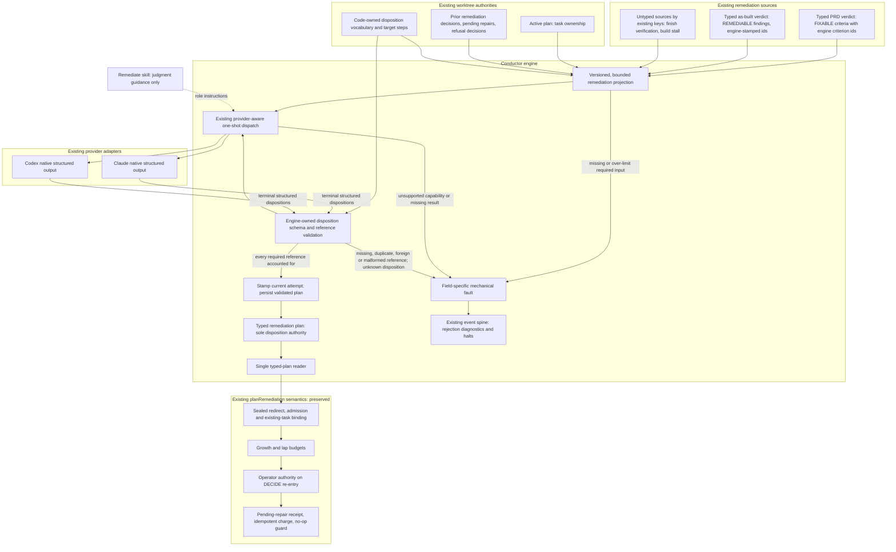

# Components: Remediation dispositions on an engine-owned contract

**Last updated:** 2026-10-07
**Scope:** Proposed migration of the `remediate` gap-plan boundary for #2522. Current production
dispatches `remediate` without a native schema and reads `.pipeline/remediation.json` through the
tolerant, mtime-gated `readRemediationPlanResult`. The shipped as-built (#2188) and PRD-audit
(#2521) migrations are the local precedent. The existing PRD-widening reconciliation mode of
`remediate` already uses the native-schema seam and is unchanged; the build_review case-v1/v2
adjudication mode keeps its own contract and reader and is out of scope.

## Diagram

## Ownership and boundaries

- The engine owns the projection, the schema, the disposition vocabulary, validation, and
  persistence. The vocabulary has one definition in code; neither the skill nor the prompt
  defines accepted values or the wire format.
- The projection names every required reference. For typed sources these are structural ids:
  PRD-audit `criterionId` and engine-stamped as-built finding ids. Untyped sources are projected
  by their existing keys; no new identity scheme is introduced for them.
- Validation accounts for every required typed reference exactly once. Missing, duplicate,
  foreign or malformed references and unknown dispositions or categories are mechanical faults
  that name the field. A schema-invalid response is never treated as a successful partial plan,
  and never becomes a substantive BLOCKED or halt judgment.
- #2187 rejection diagnostics (`remediation_disposition_rejected`) remain observable on the
  existing event spine for every rejected entry.
- One typed reader feeds `planRemediation`. Everything downstream of validation (sealed
  redirect, admission, budgets, operator authority, pending-repair idempotence, no-op guard) keeps
  its current semantics; this migration changes the boundary, not the rules.
- Restart and replay read the persisted plan for the current attempt. A file from a prior
  attempt, or a legacy prose-authored `remediation.json`, never substitutes for the current
  dispatch's validated result.
- The skill keeps judgment guidance and stays usable interactively; format prose is removed and
  a contract audit rejects its reintroduction.
- No new provider option, daemon channel, finding-history store, cross-gate policy, or generic
  step-contract registry is introduced.

## Related flows

- [Successful plan](sequences/remediation-typed-plan-success.md)
- [Missing or invalid output](sequences/remediation-typed-plan-fault.md)
- [Restart and legacy plan handling](sequences/remediation-typed-plan-restart.md)

## Legend

Solid arrows carry existing authority, structured dispositions, or typed evidence. The dotted
arrow supplies judgment guidance. Components sit inside the existing engine process; no
deployable service is added.

Event-spine verdict: no new telemetry channel. The validated plan is durable state (exception C);
fault and rejection occurrences use the existing ConductorEvent spine and halt path.

## Change Log

| Date | Change | Reason |
|------|--------|--------|
| 2026-10-06 | Initial target component diagram | Operator selected approach A for #2522 |
| 2026-10-06 | Drop build_review case from untyped sources | Architecture review: case mode never enters `planRemediation` |
| 2026-10-07 | Refusal decisions projected as a typed `refusal` reference kind | OD-5: validator rejects foreign/duplicate/malformed refusal refs; completeness stays with refusal-rework admission |
