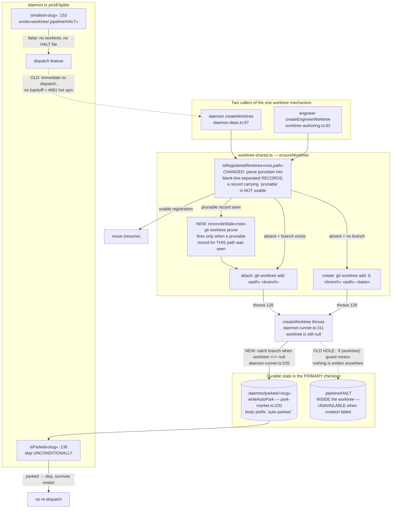

# Components: removed-but-registered worktree reconciliation and durable creation-failure park (#1022)

**Last updated:** 2026-07-27
**Scope:** The worktree create/reconcile seam (`worktree-shared.ts`) shared by the daemon
(`daemon-deps.ts`) and the engineer (`worktree-authoring.ts`), and the daemon's
creation-failure recording path (`daemon-runner.ts` → `park-marker.ts`) that gates
re-dispatch in `daemon.ts:pickEligible`.

## Diagram

## The three seams and what changes at each

| Seam | Today | After |
|---|---|---|
| `isRegisteredWorktree` (`worktree-shared.ts:86-102`) | Line-wise filter on `worktree ` prefix; a prunable path reports registered → `ensureWorktree` returns `'reused'` for a directory that does not exist | Record-wise parse; a record carrying a `prunable` line reports **not registered**, and the caller learns a stale registration was observed |
| `ensureWorktree` (`worktree-shared.ts:51-68`) | Falls straight to attach/create, which exit 128 against the surviving stale registration | Runs `git worktree prune` in `root` first **when and only when** a prunable record for this path was observed, then attaches/creates normally |
| `daemon-runner.ts` catch (`:529-543`) | `if (worktree)` — a pre-worktree throw records nothing; slug re-enters `pickEligible` as eligible | When `worktree === null`, write `writeAutoPark(projectRoot, slug, reason)` carrying the 128 cause and the prune remedy; `isParked` then gates dispatch durably |

## Why the auto-park and not a HALT

`.pipeline/HALT` is inside the worktree, so it is structurally unavailable on the exact
failure being fixed. Among the durable `.daemon/` surfaces, only `.daemon/parked/<slug>`
both survives a daemon restart and is consulted by `pickEligible` — and it is consulted
*first* (`daemon.ts:136`), before the in-memory `parked`/`started` sets, so it is a hard
dispatch gate rather than a per-run hint. `writeAutoPark` already resolves to the main repo
root even when called from a worktree (`park-marker.ts:50`), which is what makes it writable
in a context where no feature worktree exists.

## Invariants this must preserve

- **Lazy base resolution.** `resolveBase` is still invoked only on the fresh-branch path;
  the reuse and attach paths issue no extra git call. The daemon-deps test asserts this
  exact call ordering and must stay green.
- **Prune is never unconditional.** It fires only after a prunable record for the requested
  path is observed, so a healthy repo's git call sequence is byte-identical to today.
- **Park provenance stays distinguishable.** The auto-park is written through
  `writeAutoPark`, so `getProvenanceType` (`park-marker.ts:265`) continues to separate it
  from an operator park and `conduct daemon unpark` behaves normally.
- **Both callers share one mechanism.** The engineer inherits the record-aware check with no
  engineer-specific branch; its FR-7 strict-abort message replaces the current bare `ENOENT`.
