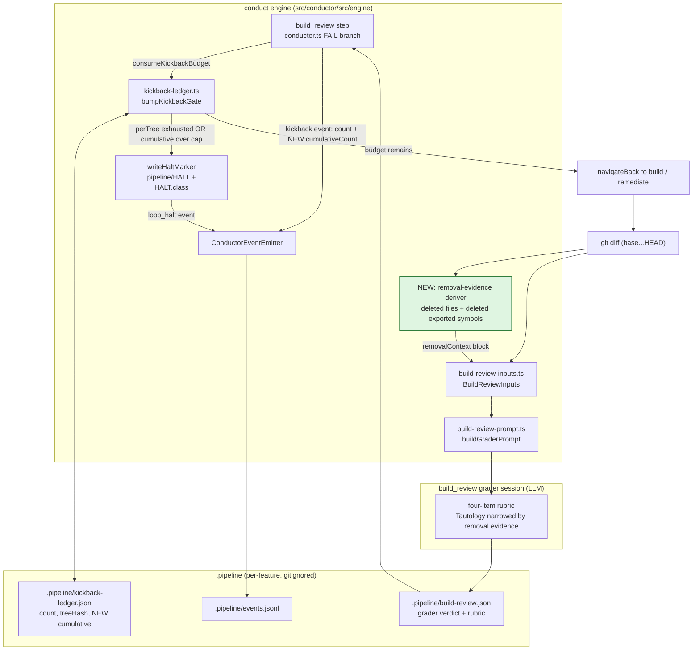

# Components: bounded build_review convergence and removal-aware Tautology grading

**Last updated:** 2026-08-12
**Scope:** The `build_review` kickback seam — `kickback-ledger.ts`, the conductor's
`build_review` FAIL branch, the grader prompt assembler, and the event spine. Issue #1521.

## Diagram

## Legend

- **Green / bold border** — the one genuinely new component: the deterministic removal-evidence
  deriver. Everything else is an existing seam that gains a field, an input, or a branch.
- `.pipeline/kickback-ledger.json` gains a **`cumulative`** counter on each gate entry. Unlike
  `count`, it is not reset by tree movement; only a gate PASS clears it. The two bounds are
  independent: `count` still bounds no-op laps over one tree, `cumulative` bounds total laps.
- The `kickback` event gains **`cumulativeCount`** so `.pipeline/events.jsonl` shows convergence.
  This extends the existing `ConductorEvent` union member — no parallel channel is introduced,
  per the repository's event-spine principle.
- **`removalContext`** joins `repairContext` and `acceptedWidenings` as a third engine-recorded
  evidence block on `BuildReviewInputs`. It is evidence, not an exemption the maker can assert:
  the engine computes it from the diff, and the grader checks changed tests against it.
- The `LEDGER → HALT` edge is the new terminal state. It writes `needs-human`, so the daemon's
  re-kick sweep will not recycle it on base advance.

## Change Log

| Date | Change | Reason |
|------|--------|--------|
| 2026-08-12 | Initial generation | Issue #1521 — build_review churned eight laps because tree movement reset the kickback budget every time, while the universal Tautology rule flagged the removal-maintenance fixture edits that each lap produced |
