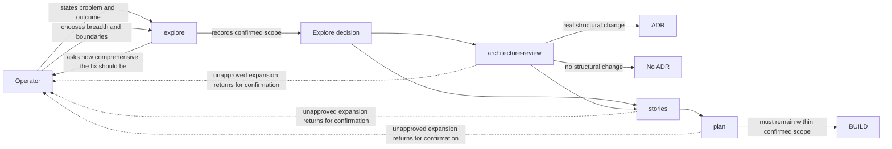

# Component Flow: Operator-Chosen Fix Comprehensiveness

**Last updated:** 2026-08-11
**Scope:** The DECIDE-phase flow that captures and preserves the operator's chosen repair breadth and limits ADR creation to structural change.

## Diagram

## Legend

Solid arrows are the normal DECIDE flow. Dotted arrows are blocking clarification loops when a downstream step identifies a materially broader solution than the operator approved.

## Change Log

| Date | Change | Reason |
|------|--------|--------|
| 2026-08-11 | Initial planned flow | Make scope breadth an explicit operator decision owned by `explore` and preserved downstream; keep ADRs structural-only |
| 2026-08-11 | Plan alignment confirmed | Three contract-only tasks implement the depicted flow without runtime machinery |
