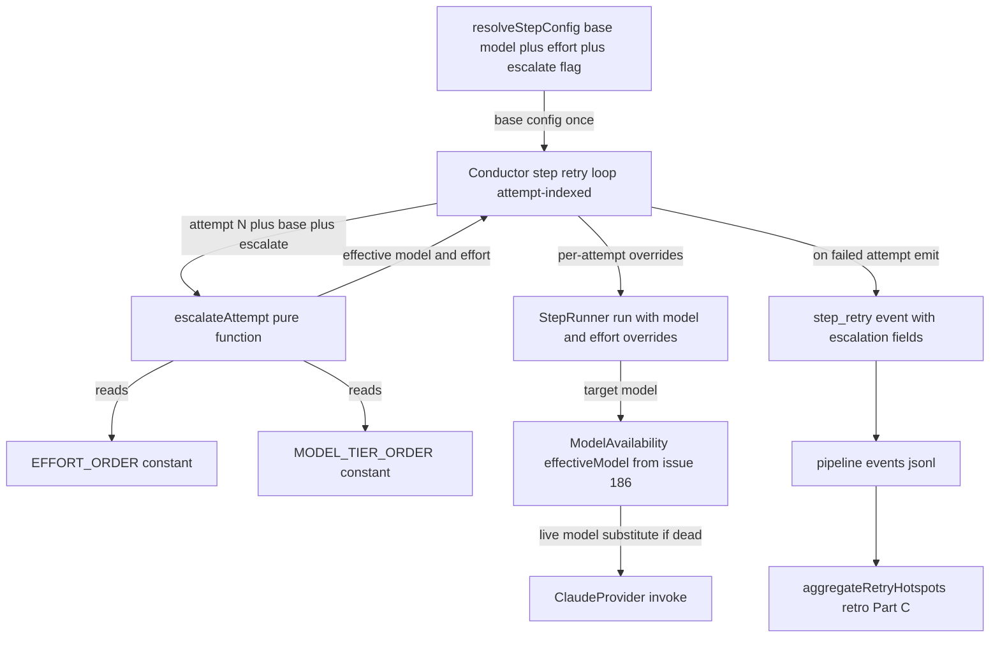

# Architecture: retry-as-escalation

C4 component-level view of where the escalation ladder attaches to the existing
step retry loop, and how it composes with the merged #186 availability ladder.

## Context

The conductor runs each SDLC step in a retry loop. Today every attempt for a
given step uses the **same** model and effort resolved once before the loop
(`resolveStepConfig`). This feature makes retries *escalate*: a failed attempt is
re-run at higher effort, then at a higher model tier, so a retry changes the odds
instead of repeating an identical coin-flip.

## Components (C4 — component level)

## Integration points (from the code map)

| Concern | Existing anchor | Change |
|---------|-----------------|--------|
| Base resolution | `resolved-config.ts` `resolveStepConfig` returns `ResolvedStepConfig{model,effort,max_retries}` | Add `escalate: boolean` (default true) to the resolved shape and precedence chain. |
| Retry loop | `conductor.ts` while-loop (~1150–1414), `attempt` is 1-based | Between `attempt++` and dispatch, compute `escalateAttempt(base, attempt, escalate)` and pass model+effort overrides into the dispatch. |
| Escalation function | none exists | New pure `escalateAttempt(baseModel, baseEffort, attempt, escalate)` in a small new module (unit-testable in isolation). |
| Effort ordering | `EffortLevel` type exists; **no order array** | Add `EFFORT_ORDER = ['low','medium','high','xhigh','max']` + `bumpEffort`. |
| Model-tier ordering | only the flat **downgrade** ladder `['fable','opus','sonnet']` in `model-availability.ts` | Add ascending **upgrade** order `MODEL_TIER_ORDER = ['haiku','sonnet','opus','fable']` + `bumpModel`. Distinct from the availability ladder (opposite direction, different purpose). |
| Availability composition | `StepRunner` already calls `modelAvailability.effectiveModel(resolved.model)` (step-runners.ts:357/403) | No new wiring: escalation changes the *target* model; the existing `effectiveModel` call downgrades it if that tier is dead. Escalation = intent; availability = liveness. |
| Dispatch overrides | `StepRunner.run` already supports an effort override path (step-runners.ts:254/273) and reads `resolved.model` | Thread per-attempt model+effort overrides through `run`'s options. |
| Logging | `step_retry` event (events.ts:28-34) carries `step,attempt,maxAttempts,reason` — **no model/effort** | Add optional `escalatedModel`, `escalatedEffort` (the values the *next* attempt will use). Persisted already via `EventPersister`. |
| Retro Part C | `aggregateRetryHotspots` (report-renderer.ts:72-108) reads `step_retry` | Extend aggregation to surface escalation (how far up each ladder a step climbed). |
| Budgets | `DEFAULT_STEP_RETRIES` (resolved-config.ts:73) explore/prd/plan/build = 5 | Reduce to **3** (not 2 — 3 is the floor that still reaches the attempt-3 model-bump rung). |
| Config validation | `config.ts` `knownStepKeys` allow-list + per-field checks | Add `escalate` to the allow-list; validate boolean (mirror `disable`). |
| Docs | HARNESS.md model-selection section; generated-table drift check (test 5a) | Document the ladder in the **prose** region (outside the generated-table markers) so the drift check still passes. |

## Key composition invariant

The escalation ladder is a **pure function of `attempt`**. The retry loop has
non-budget-consuming paths (rate-limit, stale session, auth park-and-poll) that do
`attempt--; continue`. Because escalation derives from `attempt`, those paths
neither advance nor stall escalation — a transient infra retry re-runs at the same
rung, which is correct (it was not a quality failure). No separate escalation
counter is introduced.
