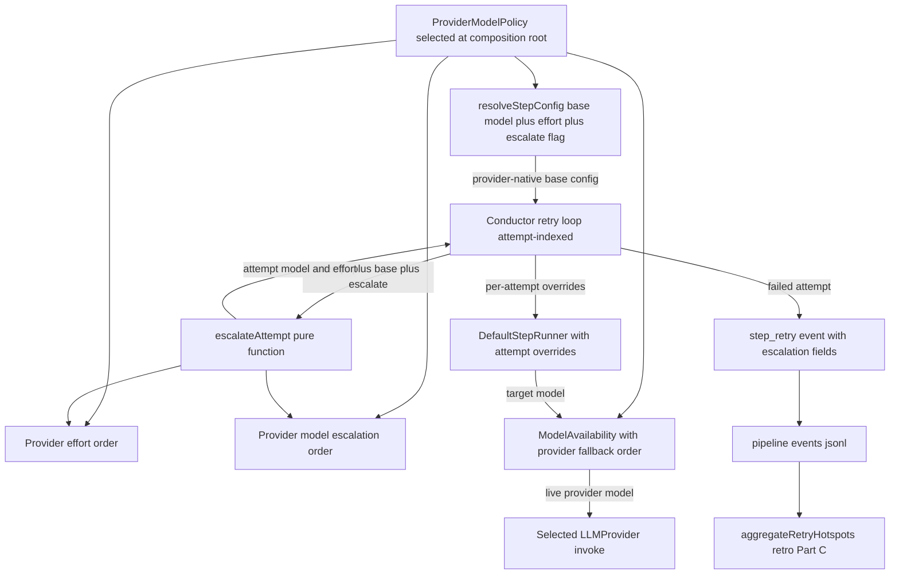

# Components: Provider-Aware Retry Escalation

**Last updated:** 2026-07-23
**Scope:** The attempt-indexed retry ladder and its composition with provider-native
model availability (issues #188 and #902).

## Diagram

## Integration Points

| Concern | Existing anchor | Provider-aware change |
|---------|-----------------|-----------------------|
| Base resolution | `resolved-config.ts` resolves model, effort, and tier overrides | Consume an explicit provider policy after user overrides; Claude models and all other efforts remain compatible, while `explore`/`prd` deliberately move to `high` (`explore.S` stays `low`) |
| Provider selection | `index.ts` and `daemon-cli.ts` select `llm_provider` | Resolve the matching policy at the same composition roots and pass it separately from `LLMProvider` |
| Effort ordering | Global `EFFORT_ORDER` | Move the order behind each built-in policy; initial Claude and Codex policies both use `low → medium → high → xhigh → max` |
| Model ordering | Global Claude `MODEL_TIER_ORDER` | Claude keeps `haiku → sonnet → opus → fable`; Codex uses `gpt-5.6-luna → gpt-5.6-terra → gpt-5.6-sol` |
| Availability | Global Claude fallback default | Use explicit `model_fallback_ladder` when configured; otherwise use the selected policy's descending provider-native ladder |
| Plugin compatibility | Arbitrary provider registry keys are accepted | Unknown keys use the legacy Claude policy with a warning; plugin policy contracts remain deferred |
| Documentation | Generator reads Claude defaults directly | Generator reads both built-in policies and labels provider-specific model and effort values |

## Invariants

- Escalation remains a pure function of the 1-based attempt number.
- Attempt 1 uses the resolved base; attempt 2 raises effort; attempt 3 and later
  climb the selected provider's model order.
- Non-budget-consuming paths such as rate limits, stale sessions, and auth waits
  retry at the same rung because they decrement the attempt counter.
- Escalation expresses capability intent; availability substitutes a live model
  from the selected provider's descending ladder.
- Explicit user model, effort, and fallback values remain opaque provider-native
  strings with their current precedence.

## Change Log

| Date | Change | Reason |
|------|--------|--------|
| 2026-07-05 | Initial generation | Retry-as-escalation DECIDE |
| 2026-07-23 | Moved model and effort ordering behind provider policies | DECIDE architecture for issue #902 |
| 2026-07-23 | Recorded the deliberate explore/PRD high-effort amendment | Superseding provider-policy ADR for issue #902 |
