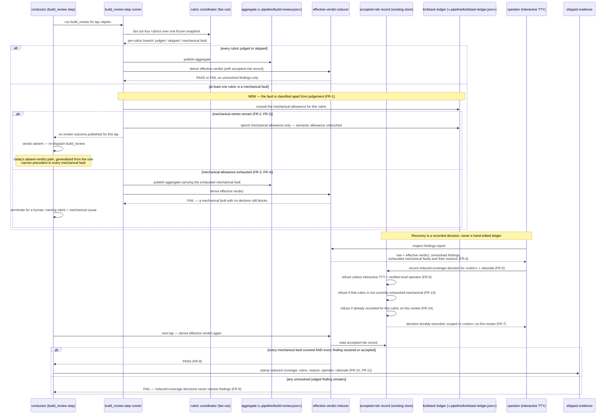

# Sequence: Mechanical rubric fault — bounded retry, operator decision, reduced-coverage evidence

**Last updated:** 2026-08-18
**Scope:** How one `build_review` lap whose rubric outcome is a mechanical fault is routed
differently from a judged FAIL: which allowance it consumes, when it terminates, what the
operator can decide, and where reduced coverage is stamped. Covers the rubric fan-out, the
aggregate, the effective-verdict reducer, the durable accepted-risk record, the kickback
ledger, the conductor's routing at the raw-FAIL branch, and the operator-facing surfaces.

Boundaries only. Names of concrete functions and files appear where they are **existing**
seams the design must live within; the mechanisms this feature adds are drawn as
capabilities, and their placement is `/architecture-review`'s call (see OQ-1..OQ-5 in the
PRD).

## Diagram

## Legend

- **Mechanical fault** — the PRD's term for a rubric branch that could not be evaluated at
  all (existing `infrastructure-failure` result kind). It is not an opinion about the diff.
- **Semantic allowance** — the existing cumulative `build_review` kickback budget that bounds
  reviewer/builder churn. This feature's core invariant is that a mechanical fault never
  decrements it.
- **Mechanical allowance** — the new, separate bound on re-attempts after a mechanical fault.
  Whether it is per rubric or per review, and whether exhaustion halts or parks, are open
  (PRD OQ-3, OQ-4).
- **No review outcome published** — the existing behavior in which the step returns failure
  without writing an aggregate, so completion sees an absent verdict and re-dispatches. It is
  reachable today only for one narrowly-matched fault; generalising it is PRD OQ-2.
- **Accepted-risk record** — the existing durable per-feature store that already holds
  operator finding acceptances. This feature extends it rather than adding a channel, per the
  repository's event-spine and no-parallel-channel rules.
- **Decision scope** — a reduced-coverage decision covers exactly one rubric on the review it
  was recorded against. What "the same review" means across laps whose inputs change is the
  central open question (PRD OQ-1); whether the decision expires on a materially changed diff
  is PRD OQ-5.

## Existing seams this design must live within

| Seam | Today | Why it matters here |
|---|---|---|
| `deriveEffectiveBuildReviewVerdict` | blocks on mechanical faults; does **not** block on `skipped` | the only place a decision can unblock a mechanical fault (FR-8) |
| conductor raw-FAIL branch | bumps the cumulative counter on any published FAIL, cause-blind | the site that must stop charging mechanical faults (FR-2) |
| build_review step runner | already returns failure without publishing for one narrow fault class | the precedent the retry lane generalises (PRD OQ-2) |
| accepted-risk record + its authority gate | interactive TTY + verified local operator | reused unchanged for the new decision (FR-6, NFR-3) |
| shipped evidence | records what shipped and under what review | must carry reduced coverage (FR-11) |

## Change Log

| Date | Change | Reason |
|------|--------|--------|
| 2026-08-18 | Initial generation | DECIDE for intake jstoup111/ai-conductor#1629 |
