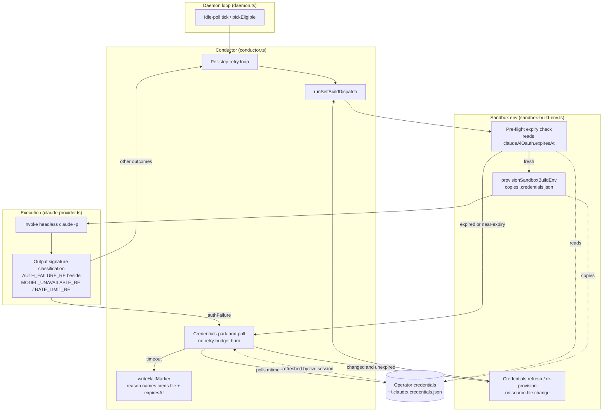

# Components: Sandbox auth-expiry park-and-poll

**Last updated:** 2026-07-04
**Scope:** Self-host build path — auth-failure classification and credentials
park-and-poll (ai-conductor#210). Shows the affected components and the two
detection points (pre-flight expiry check, output-signature classification)
feeding one shared park mechanism.

## Diagram

## Legend

- Solid arrows: control flow. Dotted arrows: file reads/writes by other actors.
- `PARK` is the single shared wait primitive both detection points funnel into;
  it consumes zero entries of the step retry budget (same contract as the
  existing rateLimited / sessionExpired paths).
- `REFRESH` re-copies credentials into the existing sandbox (or re-provisions),
  because the sandbox is provisioned once per feature run and would otherwise
  keep the stale copy across attempts.

## Change Log

| Date | Change | Reason |
|------|--------|--------|
| 2026-07-04 | Initial generation | DECIDE phase for sandbox-auth-expiry-park (issue #210) |
