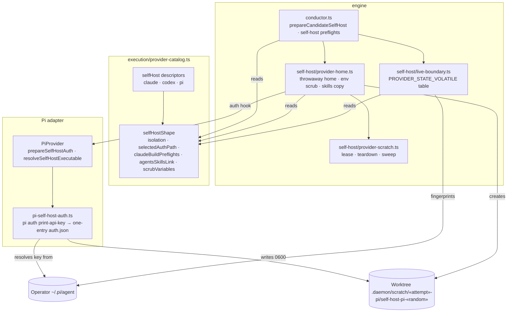

# Components: Pi Self-Host Isolation (#1887)

**Last updated:** 2026-10-03
**Scope:** The self-host isolation components a Pi self-build touches. The catalog declares each
provider's self-host shape, and the conductor, provider home and live boundary read it. Pi's
credential is resolved by Pi into a throwaway home. The flow is in
[sequences/self-host-builds-isolate-and-fingerprint-pi-operat](sequences/self-host-builds-isolate-and-fingerprint-pi-operat.md).

## Diagram

## Legend

- Cylinders are filesystem state. `«attempt»` and `«random»` are placeholders.
- "reads" edges replace the provider-id, home-variable and env-prefix comparisons these modules
  made before #1887 (adr-2026-09-24-built-in-provider-catalog-and-boot-discovery D24).

## Change Log

| Date | Change | Reason |
|------|--------|--------|
| 2026-10-03 | Initial component view | DECIDE architecture for issue #1887 |
