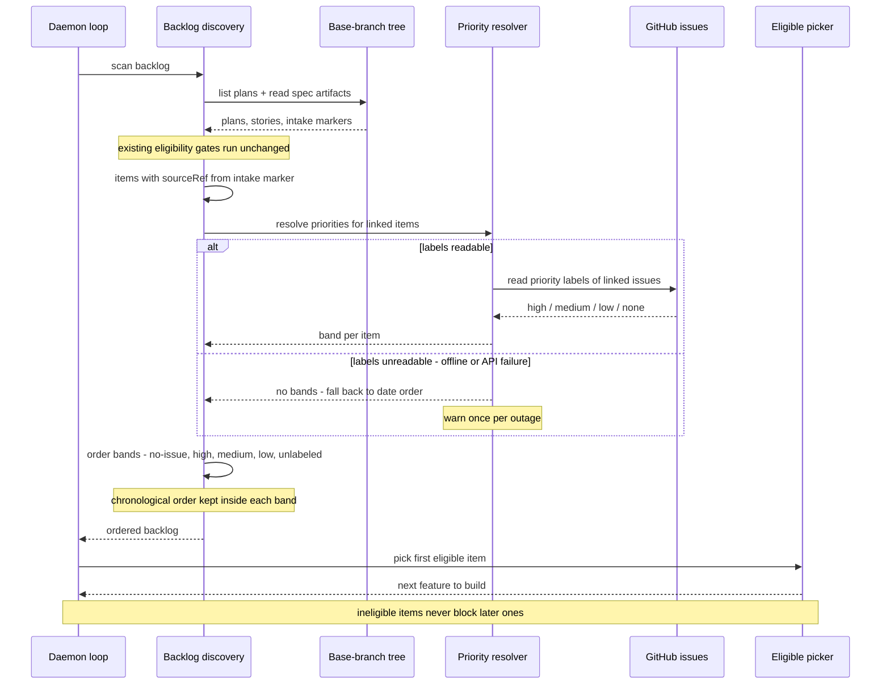

# Sequence: Daemon Issue-Priority Scheduling

**Last updated:** 2026-07-03
**Scope:** How a daemon scan orders eligible backlog items into priority bands using the
linked issue's priority label, including the fail-soft path when labels are unreadable.
Covers the discovery/ordering slice only — eligibility gates (stories approved, plan
well-formed, owner gate, processed/halted dedup) are unchanged and shown as one step.

## Diagram

## Legend

- **Backlog discovery** — the existing merged-spec scan over the committed default-branch
  tree; this feature only changes the *order* of what it returns.
- **Priority resolver** — new ordering concern: maps each item's linked issue (if any) to a
  priority band. Items with no linked issue skip the resolver and take the top band.
- **Bands** — no-issue → high → medium → low → unlabeled; multiple priority labels on one
  issue resolve to the highest (FR-9).
- **Fail-soft** — any failure to read labels degrades that scan to today's pure
  chronological order (FR-7); it never blocks or fails a build.

## Change Log

| Date | Change | Reason |
|------|--------|--------|
| 2026-07-03 | Initial generation | DECIDE for issue #200 (daemon issue-priority scheduling) |
