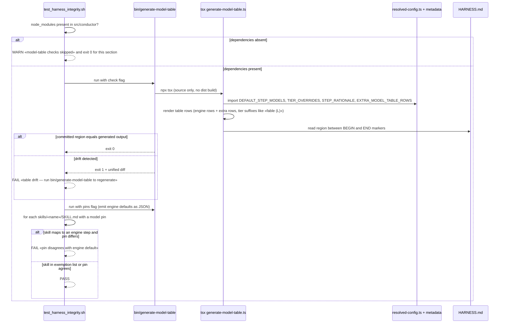

# Sequence: Model-Table Drift Check (integrity suite)

**Last updated:** 2026-07-03
**Scope:** The two new integrity-suite checks — table content drift and SKILL.md pin
agreement — including the degraded path when the conductor's dependencies are absent.

## Diagram

## Legend

- The suite never imports TypeScript itself — it shells to `bin/generate-model-table`, keeping
  the bash/TS boundary at one seam.
- «name», «fable (L)» are placeholder slugs, not literals.
- Degraded path is a warning by design: consumer checkouts without `npm install` in
  `src/conductor` must not see a false integrity failure.

## Change Log

| Date | Change | Reason |
|------|--------|--------|
| 2026-07-03 | Initial generation | DECIDE phase for intake jstoup111/ai-conductor#187 |
