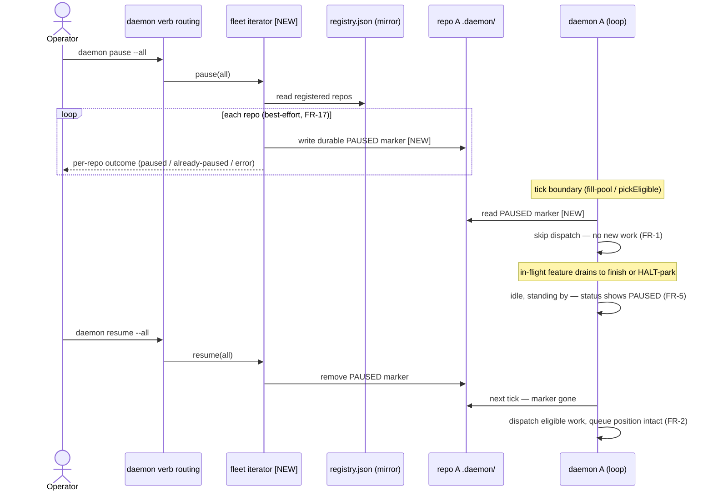
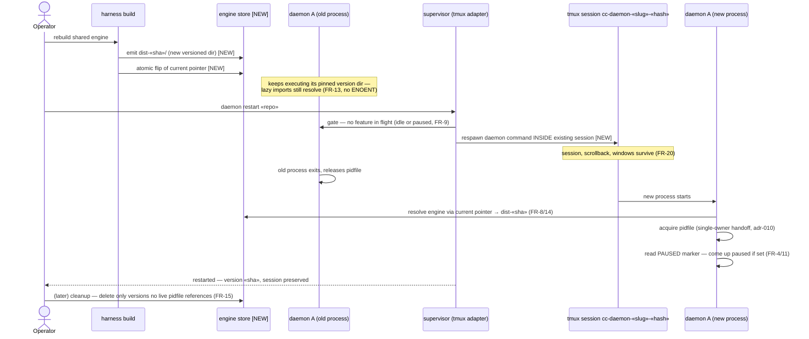

# Sequences: Daemon Lifecycle Controls

**Last updated:** 2026-07-04
**Scope:** The two load-bearing flows of daemon-lifecycle-controls: (1) fleet pause →
drain → idle, honored durably at the dispatch boundary; (2) safe engine upgrade —
rebuild with daemons running (no crash), then restart-in-place preserving the tmux
session and pause state. Placeholders use guillemets («»).

## Sequence 1 — Fleet pause, drain, resume

## Sequence 2 — Safe engine upgrade: rebuild, then restart-in-place

## Legend

- **[NEW]** — behavior added by this feature.
- `«slug»`, `«sha»`, `«hash»`, `«repo»` — placeholders.
- "engine store" — the versioned engine layout (proposed versioned dirs + atomic
  current pointer; exact mechanism confirmed in architecture-review).

## Change Log

| Date | Change | Reason |
|------|--------|--------|
| 2026-07-04 | Initial sequences | DECIDE phase for daemon-lifecycle-controls (ai-conductor#215) |
| 2026-07-04 | Confirmed against implementation plan (38 tasks, 3 phases) | /plan update pass |
