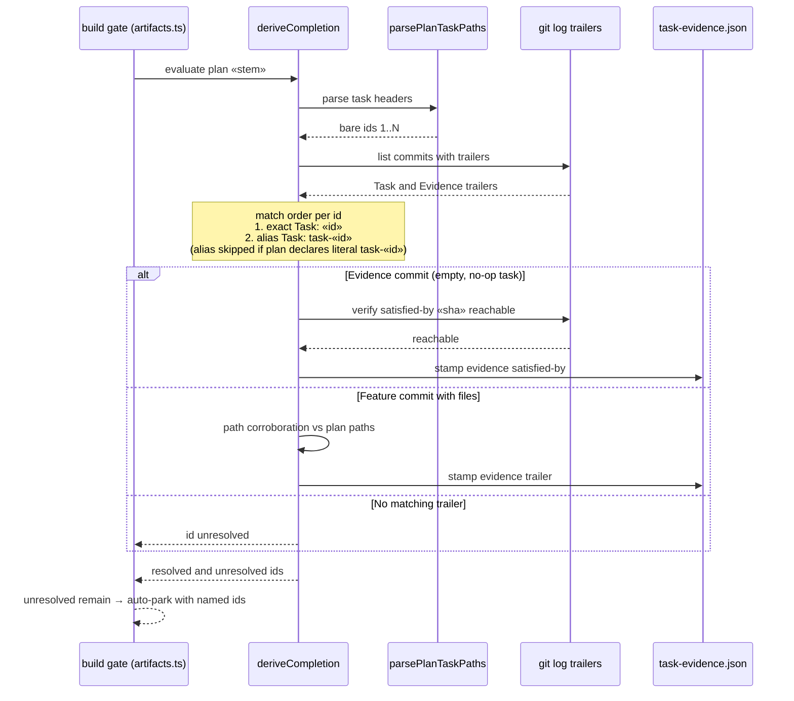

# Sequence: Evidence Derivation with Id Alias (#417)

**Last updated:** 2026-07-07
**Scope:** One build-gate evaluation after the fix — how a plan task id resolves against
commit trailers, including the new alias path and the empty-commit Evidence form.

## Diagram

## Legend

- `«id»` / `«stem»` / `«sha»` — placeholders for a plan task id, plan filename stem, and
  commit SHA respectively.
- The alias branch is the #417 addition; every other step is existing behavior shown for
  context.

## Change Log

| Date | Change | Reason |
|------|--------|--------|
| 2026-07-07 | Initial generation | DECIDE phase for #417 (engineer worktree) |
