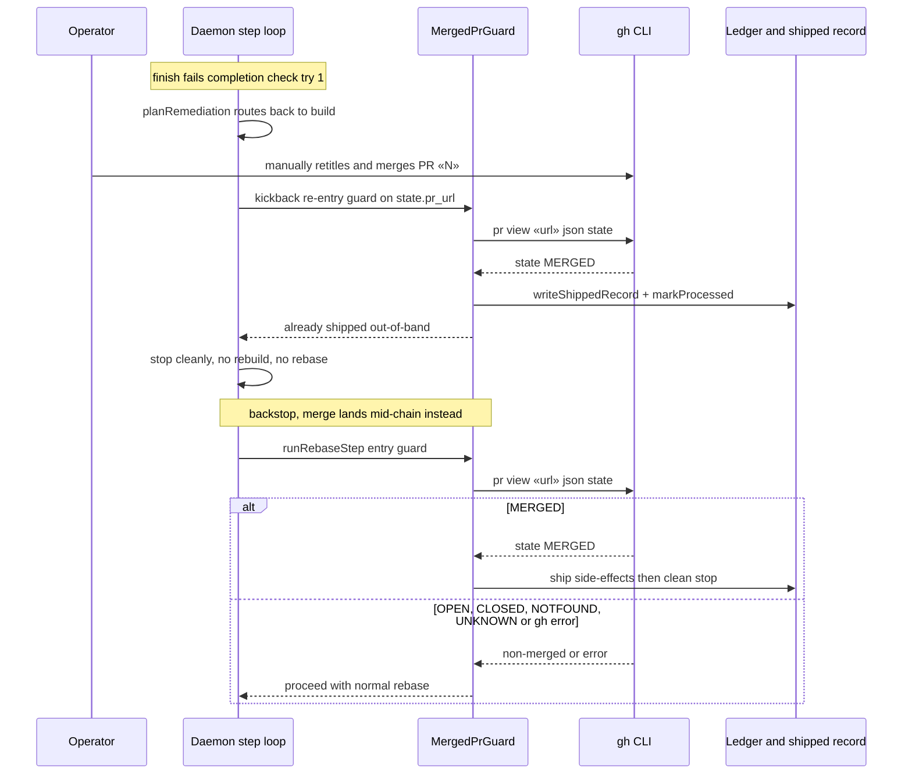

# Sequence: merged-PR guard intercepts the #358 race

**Last updated:** 2026-07-09
**Scope:** The out-of-band-merge race and how the guard exits the retry cleanly at both
insertion points.

## Diagram

## Legend

- «N» / «url» — the feature's recorded PR (`state.pr_url`).
- The guard fires at two points: kickback re-entry (earliest exit, saves the rebuild +
  audit cycle) and rebase entry (backstop for merges landing mid-chain).
- Every non-MERGED verdict — including gh failure — is advisory: the run proceeds as today.

## Change Log

| Date | Change | Reason |
|------|--------|--------|
| 2026-07-09 | Initial generation | DECIDE phase for issue #358 |
