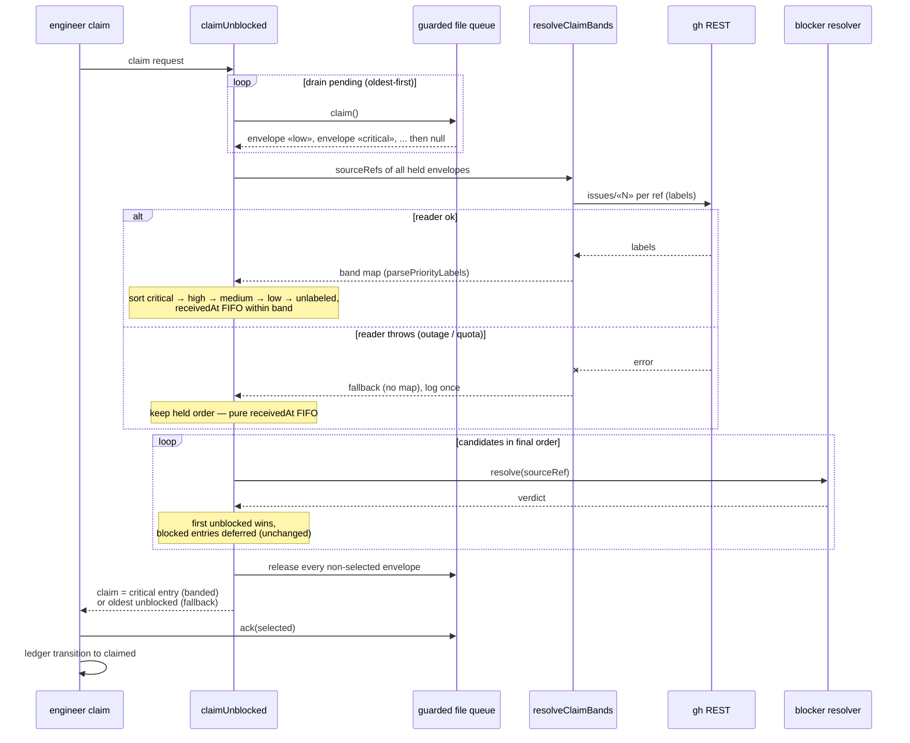

# Sequence: Priority-banded intake claim (#461)

**Last updated:** 2026-07-10
**Scope:** One `conduct-ts engineer claim` invocation with pending entries
{low(oldest), critical(newest)} — banded path and reader-outage fallback.

## Diagram

## Legend

- The drain loop and release-all-deferred behavior already exist for all-blocked
  detection — banding only changes the *order* candidates are offered to the blocker
  resolver, never queue mechanics or deferral semantics.
- Outage fallback is per-claim and logged exactly once per invocation; the next claim
  retries banding fresh (each claim is a new process — no cross-claim cache).

## Change Log

| Date | Change | Reason |
|------|--------|--------|
| 2026-07-10 | Initial generation | DECIDE phase for issue #461 |
