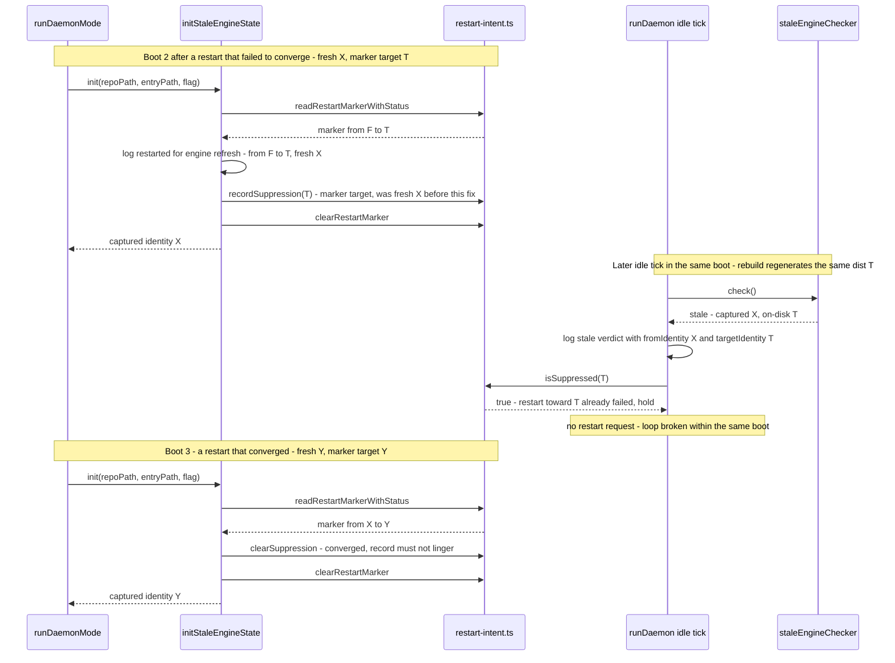

# Sequence: Suppression lifecycle after the #369 repair

**Last updated:** 2026-07-10
**Scope:** Non-convergent restart followed by a converged boot — showing the corrected suppression key (marker target) and the newly wired clear-on-convergence. Boot runs through `initStaleEngineState` (single path).

## Diagram

## Legend

- **X / T / F / Y** are engine identities (sha256 of `dist/index.js`): F = pre-restart, X = fresh non-converged boot, T = the target that failed to converge, Y = a later converged identity.
- Before this fix, boot 2 recorded **X** — but a stale verdict in that boot means on-disk ≠ X, so `isSuppressed(on-disk)` could never match and the restart loop continued.
- Boot 3's `clearSuppression` is the newly wired call — previously the function had zero production callers and a stale record persisted until it happened to be overwritten.

## Change Log

| Date | Change | Reason |
|------|--------|--------|
| 2026-07-10 | Initial generation | DECIDE phase for issue jstoup111/ai-conductor#369 |
