# Sequence: Rekick Resume With Unsatisfied Build Verdict (#532)

**Last updated:** 2026-07-11
**Scope:** The #532 incident flow (operator clears HALT, drops REKICK) — before and after the
verdict-aware resume entry fix. Pre-fix, the state-only resume index jumps past the failed
build to `finish`; post-fix, the verdict clamp lands on `build`.

## Diagram

```mermaid
sequenceDiagram
    participant OP as Operator
    participant DR as daemon-rekick
    participant CR as conductor.run resume
    participant ST as conduct-state.json
    participant GV as gates verdicts on disk

    OP->>DR: clear HALT + drop .pipeline/REKICK
    DR->>DR: resumeRebaseFirst — NOOP rebase
    DR->>GV: rebase.json satisfied true (noop early-return)
    Note over GV: build.json stays satisfied false<br/>(kickback from earlier file-changing rebase)
    DR->>ST: recordRebaseStepCompletion — rebase done
    DR->>CR: run with resume true

    rect rgb(120, 40, 40)
        Note over CR,GV: PRE-FIX (the bug)
        CR->>ST: findResumeIndex — state only
        ST-->>CR: no in_progress, last done rebase → start at finish
        CR->>CR: checkGate finish — prereq rebase done → pass
        CR->>OP: dispatches finish (false-ship path)
    end

    rect rgb(30, 80, 50)
        Note over CR,GV: POST-FIX (verdict clamp)
        CR->>ST: findResumeIndex — state-derived candidate finish
        CR->>GV: readAllVerdicts
        CR->>CR: gateSatisfied per loop-region gate<br/>build verdict satisfied false
        CR->>CR: clamp start index to earliest unsatisfied gate
        CR->>OP: dispatches build (correct)
    end
```

## Legend

- **Red block** — pre-fix behavior observed live during the #520 build (only an operator kill
  prevented a push).
- **Green block** — post-fix behavior: the resume entry consults the same verdict-authoritative
  selector semantics the loop tail uses (`gateSatisfied` / `selectNextGate`).
- Negative path (not shown): all verdicts satisfied → the clamp changes nothing and the
  state-derived fast-forward stands — no re-running of completed work.

## Change Log

| Date | Change | Reason |
|------|--------|--------|
| 2026-07-11 | Initial generation | DECIDE phase for #532 (verdict-aware resume entry) |
