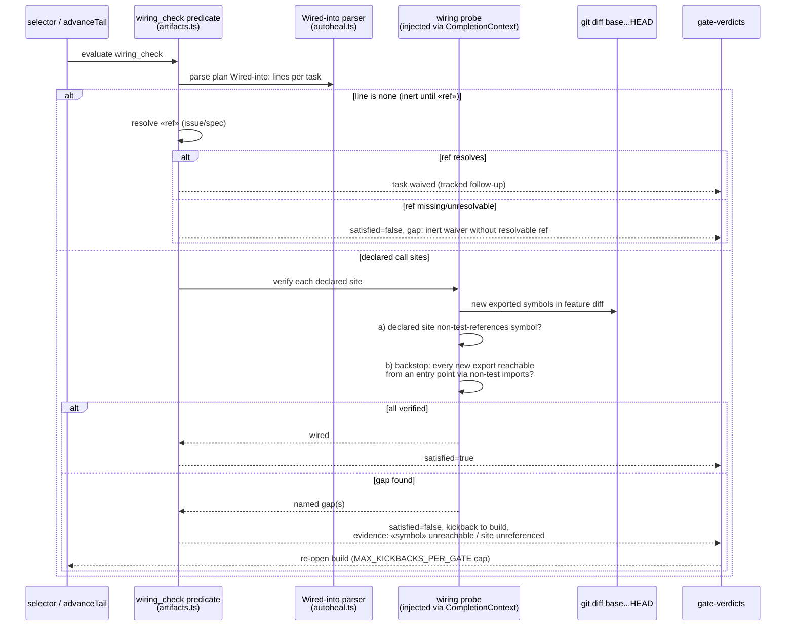

# Sequence: wiring_check gate evaluation (#462)

**Last updated:** 2026-07-12
**Scope:** One evaluation of the new `wiring_check` gate after `build_review` passes —
contract verification, orphan backstop, inert waiver, and the kickback path.

## Diagram

## Legend

- The predicate is pure and injectable (push-evidence `GitRunner` pattern) — deterministic,
  network-free except the waiver-ref resolution, test-injectable.
- A missing `Wired-into:` line on a task that adds exports is itself a named gap for the
  backstop path — undeclared primitives cannot pass silently.
- Kickback consumes the existing anti-ping-pong machinery; exhausting the cap escalates via
  the existing stall-halt path (unchanged behavior, not a new HALT).

## Change Log

| Date | Change | Reason |
|------|--------|--------|
| 2026-07-12 | Initial generation | DECIDE phase for issue #462 |
