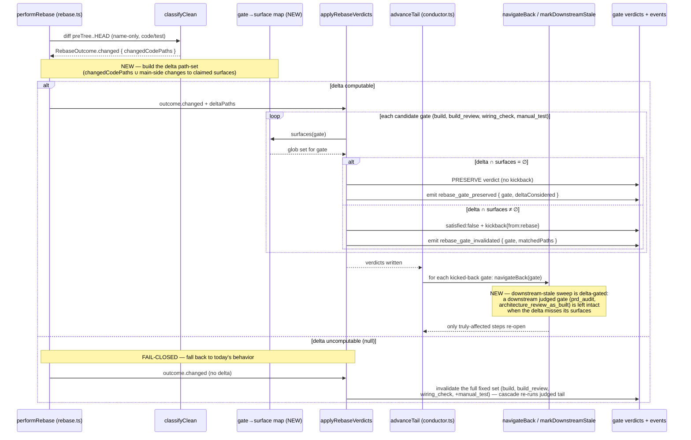

# Sequence: Post-rebase delta-aware gate invalidation (#655)

**Last updated:** 2026-07-20
**Scope:** How the finish-time rebase delta flows into per-gate invalidation decisions —
which gate verdicts are re-run vs preserved after a file-changing rebase, and the fail-closed
fallback. Amends the phase-9.0 rebase-loop-tail flow.

## Diagram

## Legend

- **NEW** boxes are introduced by this feature; everything else exists today.
- **claimed surfaces** — the feature's own source/artifact paths a gate's verdict depends on;
  the gate→surface map declares these per gate (e.g. `prd_audit` → `.docs/specs/**` + feature
  source; `architecture_review_as_built` → `.docs/architecture/**` + feature source;
  `manual_test` → non-test feature source; `build_review` → feature-source diff).
- **delta path-set** — union of the rebase's `changedCodePaths` (conflict resolutions +
  main-side code/test changes surviving into the feature tree) computed by `classifyClean`.
- **PRESERVE** — the gate's prior `satisfied:true` verdict is kept; no kickback, no re-open,
  no downstream-stale — recorded as an auditable `rebase_gate_preserved` event.
- **FAIL-CLOSED** — if the delta cannot be computed, the system reverts to today's
  invalidate-everything behavior; correctness is never traded for the optimization.

## Change Log

| Date | Change | Reason |
|------|--------|--------|
| 2026-07-20 | Initial generation | Delta-aware invalidation design for #655 |
