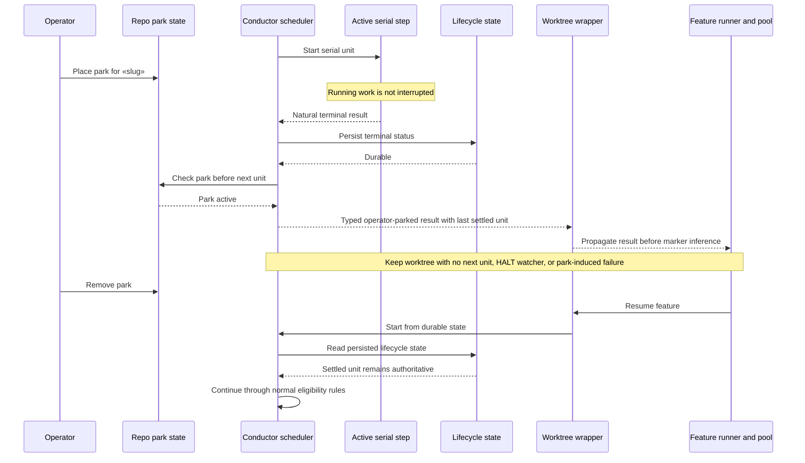
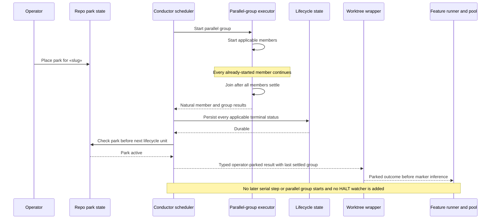

# Sequence: Boundary-aware operator parking

**Last updated:** 2026-07-29
**Scope:** Serial-step and parallel-group park timing, durable status ordering, intentional outcome classification, and state-preserving resume.

## Serial step

## Parallel group

## Legend

- Park state is sampled only at lifecycle-unit boundaries, not continuously during model or test execution.
- The serial step or complete parallel group settles before the boundary stop is classified.
- Removing the park later resumes from lifecycle state; parking alone never rewrites a member result.

## Change Log

| Date | Change | Reason |
|------|--------|--------|
| 2026-07-29 | Initial serial and parallel boundary sequences | DECIDE for boundary-aware operator parking |
| 2026-07-29 | Added planned typed-result propagation and pool classification | Plan-update mode |
