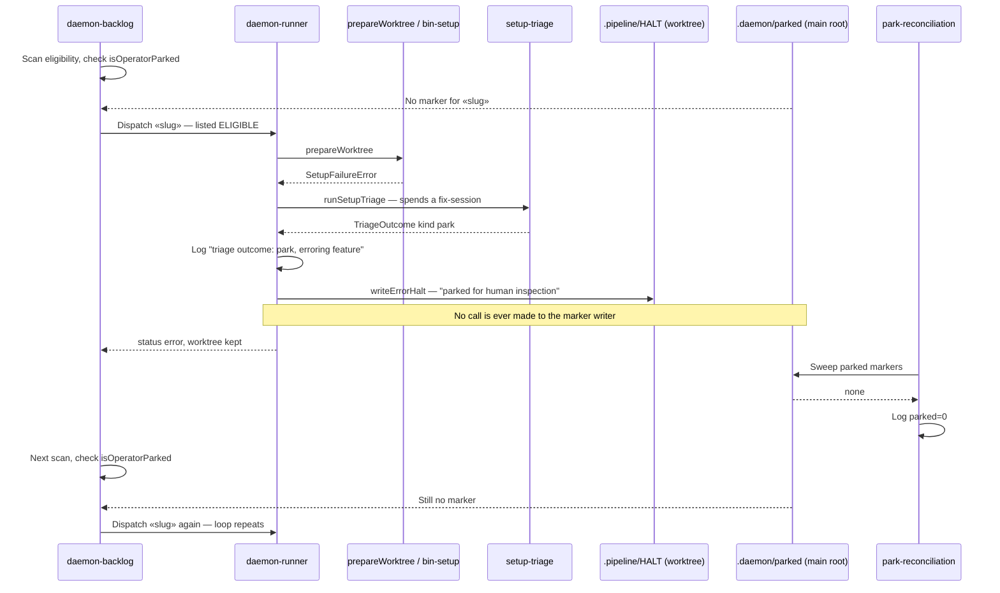
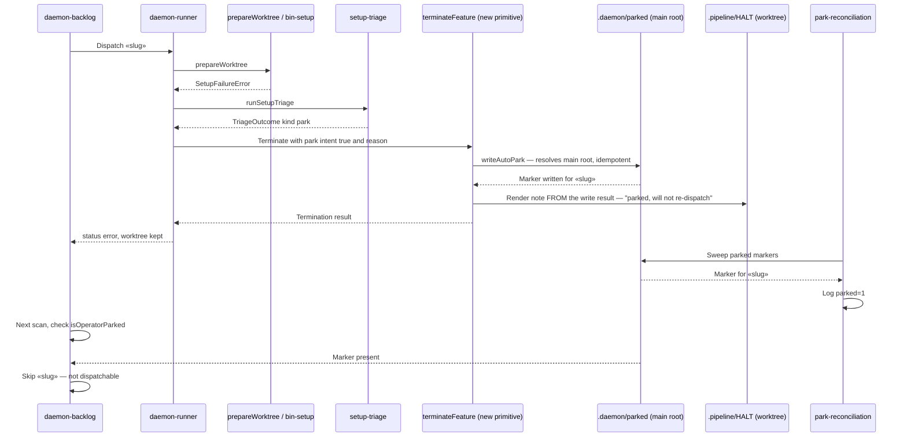
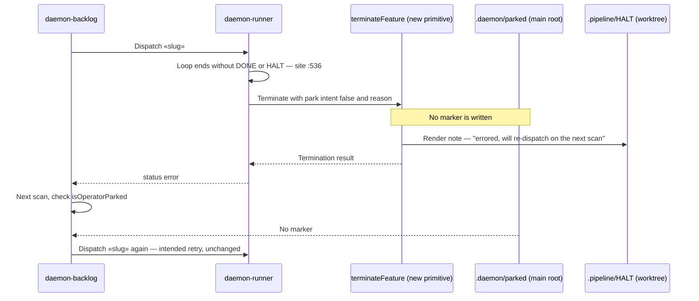
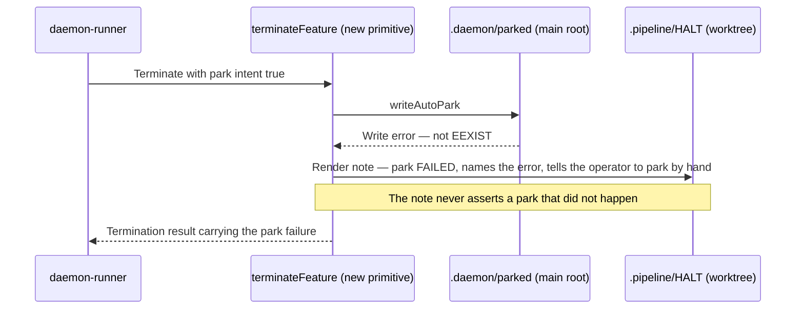

# Sequence: Automatic park marker write

**Last updated:** 2026-08-06
**Scope:** The setup-failure termination flow through the daemon error boundary, before and after
the honest-park change. Covers intake `jstoup111/ai-conductor#1328`.

## Today — the infinite re-dispatch loop

Each turn of this loop spends a whole fix-session on the same unresolved wall. The HALT the
operator reads asserts the feature was parked, so the state that would stop the loop looks like it
already exists.

## After — park intent settles durable state before the note is written

## After — a non-park error still re-dispatches

## After — the marker write fails

## Legend

- `«slug»` is the feature slug placeholder.
- `.pipeline/HALT` is worktree-local and disposable; `.daemon/parked/«slug»` is main-root and
  durable. Only the latter is consulted by `daemon-backlog` eligibility.
- "Render note FROM the write result" is the ordering constraint that makes the HALT's claim
  structurally true rather than prose the caller is trusted to keep in sync.

## Change Log

| Date | Change | Reason |
|------|--------|--------|
| 2026-08-06 | Initial generation | Spec for intake #1328 — automatic park writes no marker |
