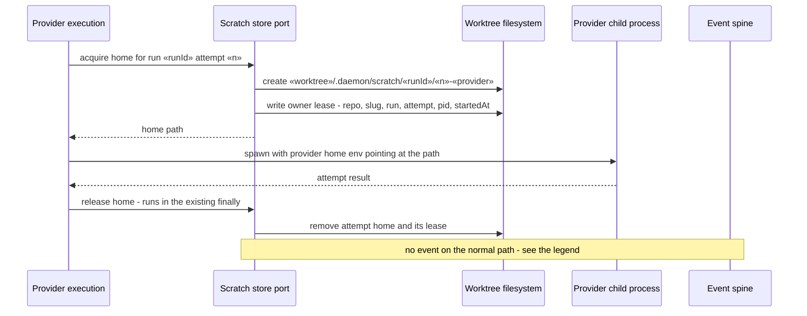
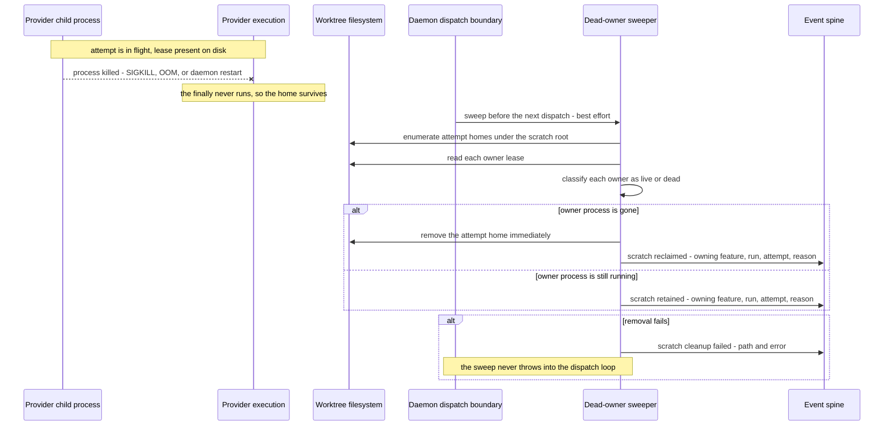
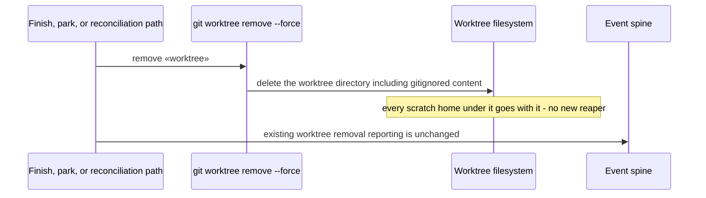

# Sequence: Provider scratch acquire, release, and orphan recovery

**Last updated:** 2026-08-09
**Scope:** The three lifecycle paths for a throwaway provider home — normal completion, an interrupted attempt recovered by the dead-owner sweep, and the worktree-reap backstop.

## Diagram: normal attempt

## Diagram: interrupted attempt recovered at the next dispatch boundary

## Diagram: worktree reap backstop

## Legend

- **Owner lease** carries repository, feature slug, run id, attempt, owning process id, and start time. It is what makes "dead" decidable without inspecting a live home.
- **Live owner** is never deleted. When liveness cannot be determined, the home is retained and the reason is reported — the sweep fails toward retention, because deleting a live provider home corrupts an in-flight attempt.
- **Dead owner** is deleted immediately. Provider homes hold no post-attempt value, so no grace window is needed to preserve one.
- The sweep is best-effort in exactly the way the existing daemon reconciliation hooks are: a throw is caught and reported, and the dispatch loop is never disrupted.
- Cleanup reporting rides the existing event spine; nothing writes a bespoke log or sidecar format.
- **No event is emitted on the normal completion path.** Release happens on every attempt of every step, so an event for it would be high-volume and carry no diagnostic value none of the intake's outcomes ask for. The three variants are reclaimed, retained, and failed — the cases an operator investigating storage growth actually needs.

> **Amended 2026-08-10 by #1223:** the normal-path "scratch released" emission was removed from the first diagram. Conflict-check found it inconsistent with the three-variant set the stories enumerate; the three-variant set stands.

## Change Log

| Date | Change | Reason |
|------|--------|--------|
| 2026-08-09 | Initial generation | DECIDE for intake #1223 — interrupted self-host runs leak provider homes until the tmpfs quota fails |
