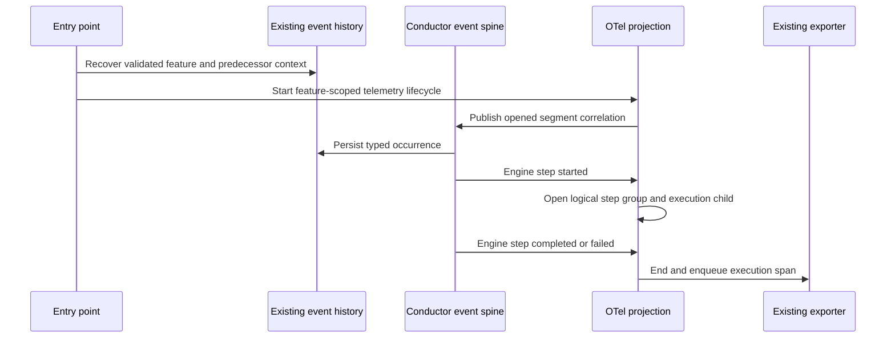
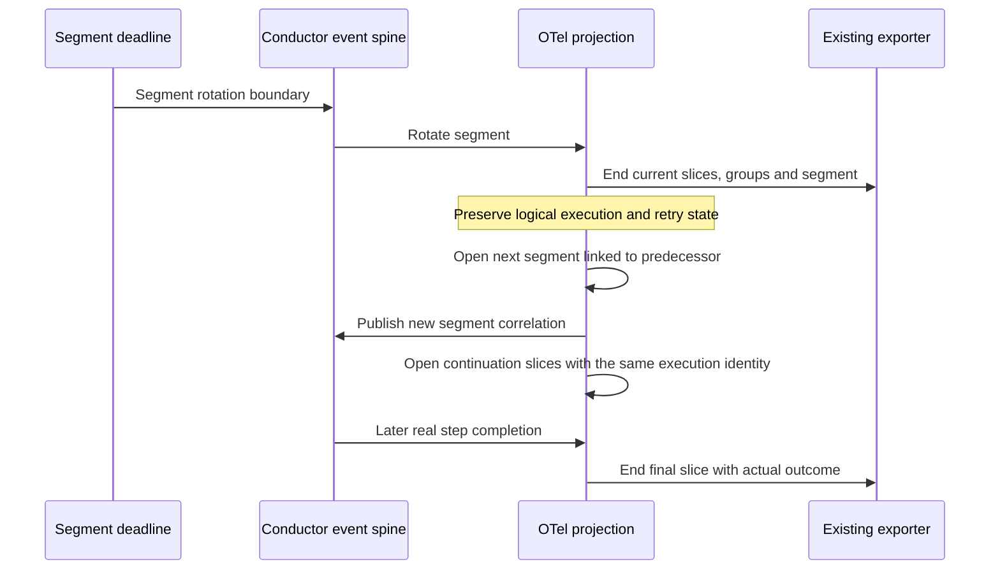
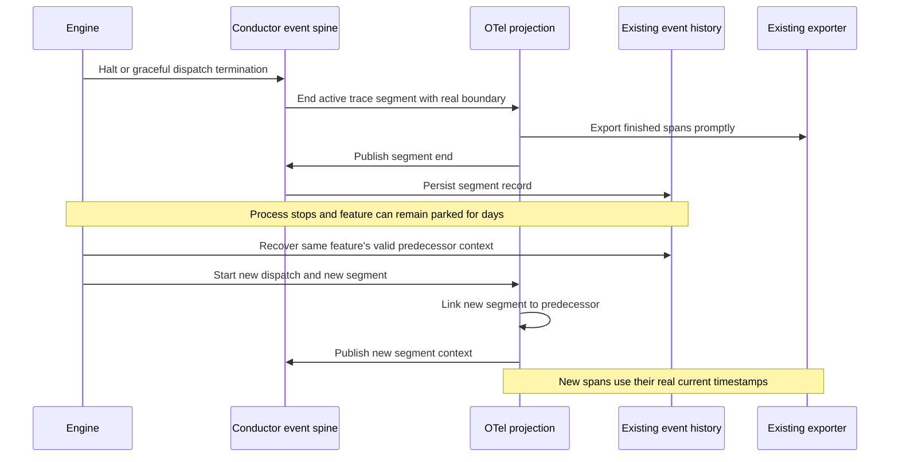
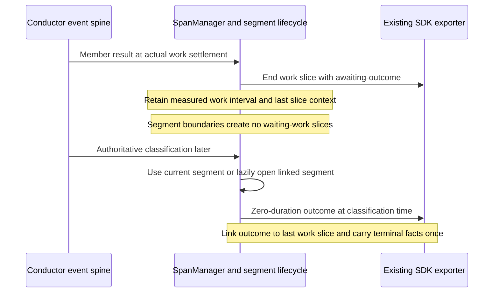

# Sequences: Trace rotation and feature restart

**Last updated:** 2026-09-30
**Scope:** Three key flows in the #2011/#2009 bounded trace design.
**Review:** Diagrams approved by the operator on 2026-09-30.

## 1. Dispatch and ordinary execution

## 2. Deadline while a step is still executing

A timer rotation does not emit step_completed, feature_complete, or a fake dispatch end.
All children remain independently inspectable. The deadline path also checks elapsed time
when execution resumes after scheduling delay; it must not claim that missing observations
or delayed export were timely delivery.

## 3. Halt, three-day gap, and redispatch

An abrupt crash may leave only the opened-segment record. Recovery may link to that recorded
context without pretending the old segment ended cleanly or reached the backend.
Invalid/missing/mismatched context yields a fresh unlinked segment, never another feature's
parent. A real new execution after a halt is not mislabeled as a continuation slice.

**Plan-update review:** Approved with the implementation plan in chat on 2026-09-30.

## 4. Early member settlement and delayed classification

> **Amended 2026-09-30 by #2011:** Tasks 13–15 implement approved D24's separate
> work and outcome boundaries. In sequence 1, starting the telemetry lifecycle
> prepares context only: the segment opens lazily on trace-bearing activity, and
> its opened record is queued outside the engine-event handler before a child is
> advertised as recoverable. This also preserves no-work startup behavior.

The exported work span is immutable. Waiting for classification neither stretches its
work duration nor holds a span open across days. A catchable interruption records an
incomplete outcome with the original measured work interval; abrupt loss never fabricates
success. A previously active idle dispatch may open a short final segment for its terminal
outcome, whereas a dispatch with no trace-bearing activity stays span-free.

## Legend

History is the existing ConductorEvent ledger, not a new correlation file. Export means
handoff to the current SDK/exporter pipeline, not a guarantee of backend retention.
The separate durable-export-queue feature owns retry and spool delivery.

## Change Log

| Date | Change | Reason |
|---|---|---|
| 2026-09-30 | Initial three lifecycle sequences | Make deadline rotation and multi-day recovery reviewable before the ADR |
| 2026-09-30 | Plan update adds late-classification sequence and clarifies lazy startup | Preserve settlement timing, no-work behavior and bounded terminal records |
