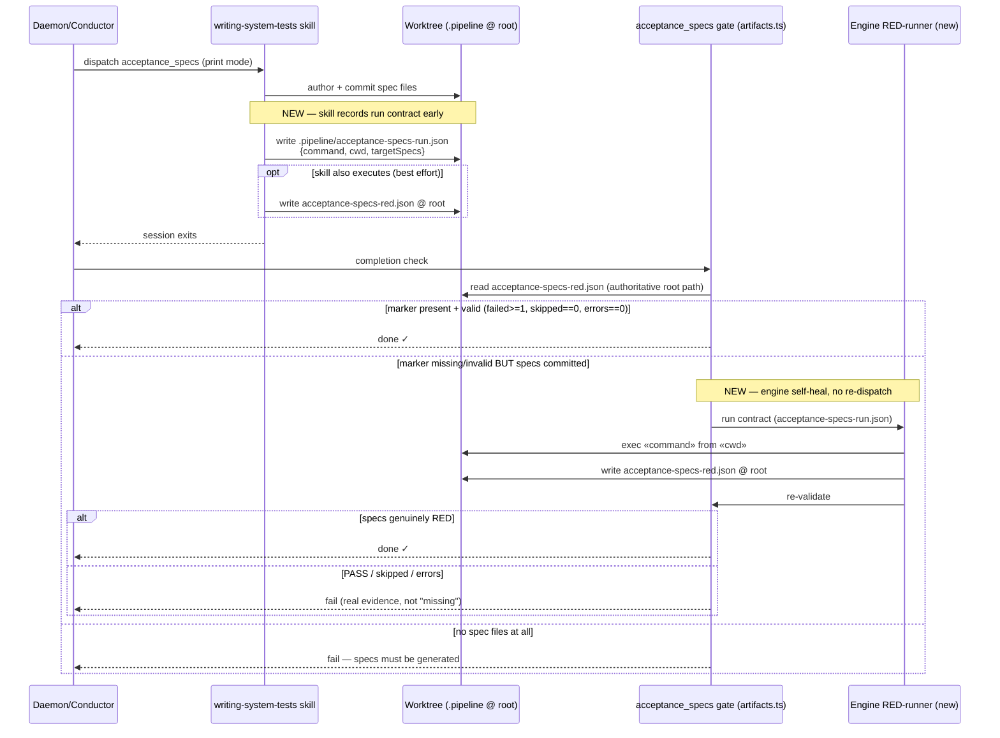

# Sequence: acceptance_specs RED-evidence (engine-owned execution)

**Last updated:** 2026-07-21
**Scope:** The `acceptance_specs` step of a daemon/conduct build — how the RED
execution marker (`.pipeline/acceptance-specs-red.json`) is produced and gated.
Reflects the planned (Hybrid C) architecture for #741.

## Diagram

## Legend

- **NEW** notes mark the two additions for #741: (1) the skill records a
  `{command, cwd, targetSpecs}` run contract when it authors specs; (2) the engine
  gate self-heals a missing/invalid RED marker by executing that recorded contract
  itself (from the recorded cwd) and writing the marker to the **authoritative
  worktree-root path** — instead of failing "missing" and re-dispatching a prompt.
- `«command»` / `«cwd»` are guillemet placeholders for the recorded contract values.
- The old behavior (removed): a missing marker → HALT after ~15s no-op retries, with
  the marker occasionally stranded in a nested `src/conductor/.pipeline/` by a
  cwd-relative write.

## Change Log

| Date | Change | Reason |
|------|--------|--------|
| 2026-07-21 | Initial generation | #741 — engine-owned RED execution + cwd-robust marker resolution |
