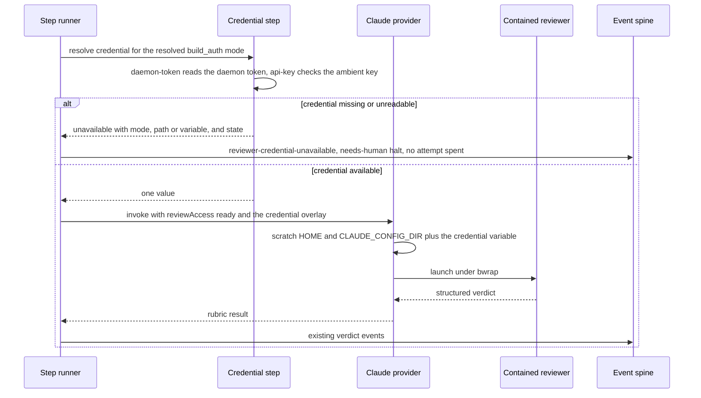

# Sequence: Contained Claude reviewer credential resolution

**Last updated:** 2026-09-24
**Scope:** One contained Claude build_review member dispatch for #2737, from credential resolution to verdict or refusal.

## Diagram

## Legend

The credential value flows only through the provider env overlay; no credential file is written to scratch.

## Change Log

| Date | Change | Reason |
|---|---|---|
| 2026-09-24 | Initial sequence | #2737, resolved-mode credential |
