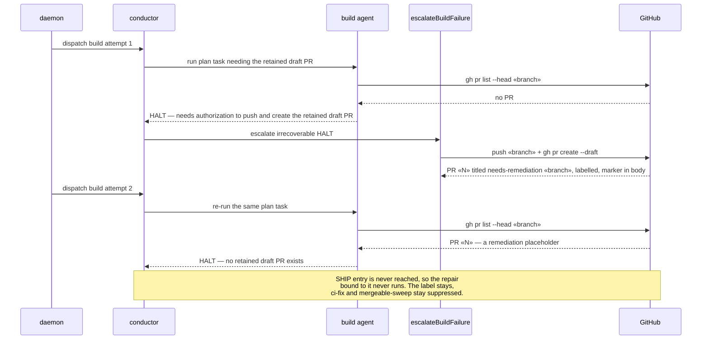
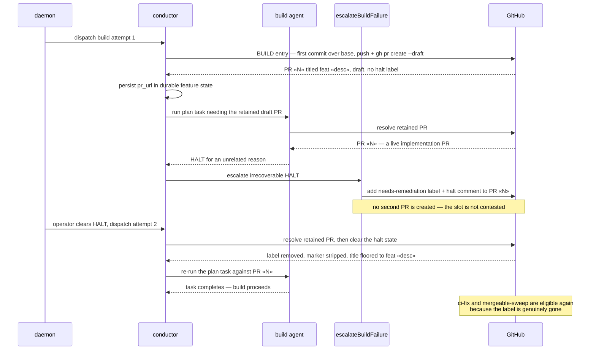

# Sequence: HALT → re-dispatch → resume, with one PR per branch

**Last updated:** 2026-08-09
**Scope:** the deadlock flow reported in jstoup111/ai-conductor#1415 and the target flow that
replaces it. Covers PR birth, HALT decoration, and the deterministic clear on a successful
re-dispatch.

## Diagram — today (deadlock)

## Diagram — target

## Legend

- **Today** — the retry finds the placeholder and refuses it, and every repair mechanic is
  reachable only from SHIP entry, a phase this flow never reaches. The result is a loop that
  burns the attempt budget re-asking one question.
- **Target** — the PR is born before any task can need it, the HALT is a *decoration* on that
  PR, and clearing the HALT plus a re-dispatch is sufficient to resume. No operator edits a
  title, a body, or a label by hand.
- **Not shown** — a HALT that occurs before the branch has any commit over base. There is no PR
  to decorate in that window; the escalation surface for it is an open question carried into
  `/architecture-review`.
- `«»` marks variable parts of labels (PR numbers, branch names, descriptions).

## Change Log

| Date | Change | Reason |
|------|--------|--------|
| 2026-08-09 | Initial generation | DECIDE phase for issue #1415 (engineer session) |
