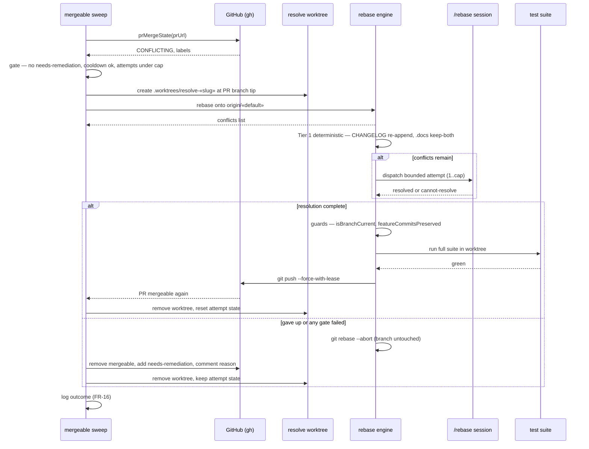

# Sequence: Auto-Resolve a Conflicting Open PR

**Last updated:** 2026-07-04
**Scope:** One sweep tick handling a watched PR that GitHub reports CONFLICTING — happy path
(deterministic-only resolution) with the escalation alternative.
**Source PRD:** `.docs/specs/2026-07-04-auto-resolve-open-pr-conflicts.md`

## Diagram

## Legend

- The **only** externally visible mutation on the success path is the lease-protected push.
- The escalation path mutates labels + one comment; the PR branch itself is never touched.
- «slug» / «default» are placeholders for the feature slug and the repo's derived default branch.

## Change Log

| Date | Change | Reason |
|------|--------|--------|
| 2026-07-04 | Initial generation | New auto-resolution flow (intake #247) |
