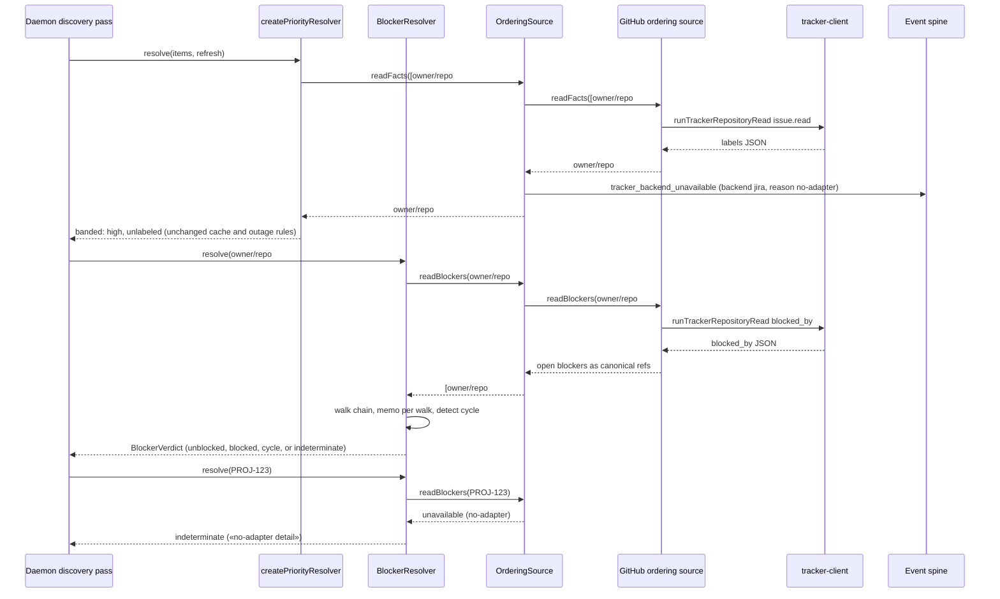

# Sequence: Backlog Ordering Read Through the Ordering Port (#851)

**Last updated:** 2026-10-10
**Scope:** One daemon discovery pass. The pass resolves priority bands and blocker verdicts for a
backlog that mixes a GitHub-linked item and a Jira-linked item. The intake claim, the overlap scan, and
the coherence-check consumers follow the same port path.

## Diagram

## Legend

- **OrderingSource** dispatches each reference by its parsed kind. GitHub references take exactly
  today's `gh` reads. A Jira key returns `unavailable` without a network call.
- **Priority:** an `unavailable` reference bands as `unlabeled`, the same band a not-found reference
  gets today, so ordering is unchanged. The difference is that the gap is now reported on the event
  spine.
- **Blockers:** an `unavailable` reference yields an `indeterminate` verdict. That verdict already
  exists in the closed `BlockerVerdict` union, and every caller handles it today.

## Change Log

| Date | Change | Reason |
|------|--------|--------|
| 2026-10-10 | Initial generation | #851 DECIDE: backend-neutral ordering reads |
