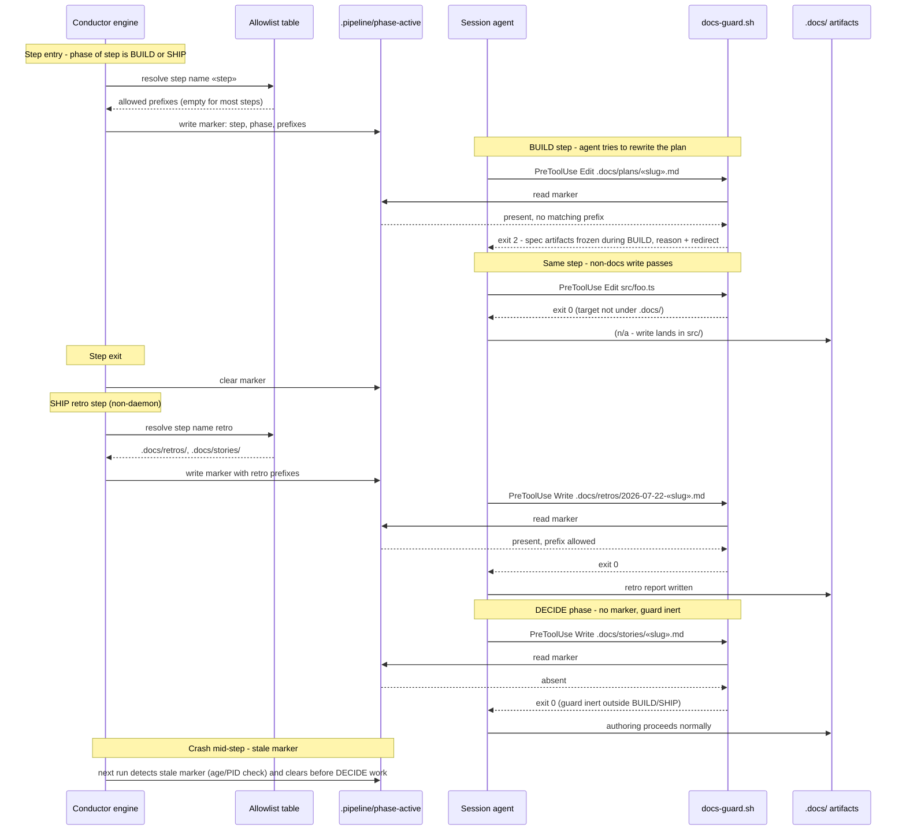

# Sequence: Phase-Scoped .docs Write-Guard (#788)

**Last updated:** 2026-07-22
**Scope:** Marker lifecycle around a BUILD/SHIP step and the docs-guard decision paths:
blocked spec edit, allowlisted retro write, pass-through outside `.docs/`, and inertness
during DECIDE.

## Diagram

## Legend

- `docs-guard.sh` runs on the write surface (Edit, Write, NotebookEdit) as a sibling of
  the untouched attribution `mutation-gate.sh`.
- The marker carries the resolved allowlist so the hook needs no engine or YAML logic.
- Stale-marker handling: a marker left by a crashed step must not freeze `.docs/` for a
  later DECIDE session — cleared by the engine on next step transition (exact mechanism
  decided in architecture review / plan).
- `«…»` — placeholder for a variable value.

## Change Log

| Date | Change | Reason |
|------|--------|--------|
| 2026-07-22 | Initial generation | DECIDE phase for #788 (engineer spec authoring) |
