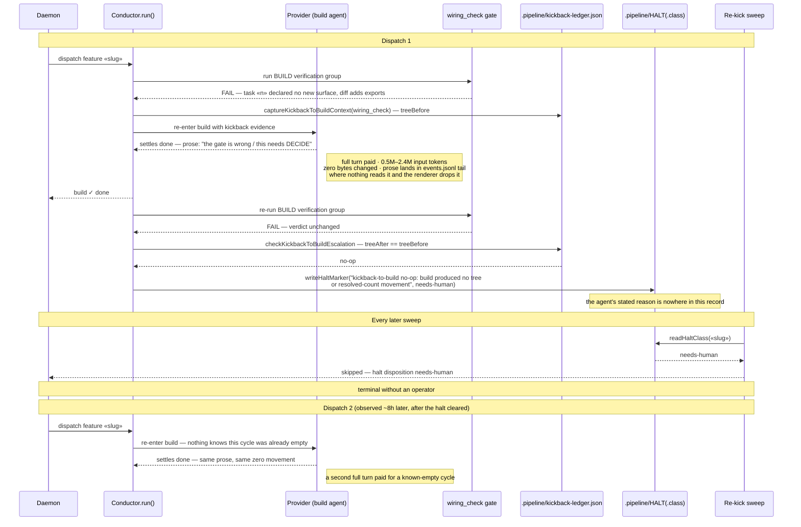
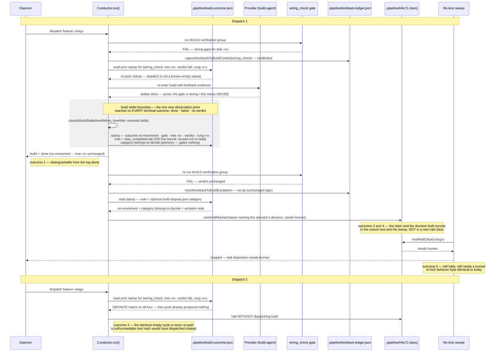
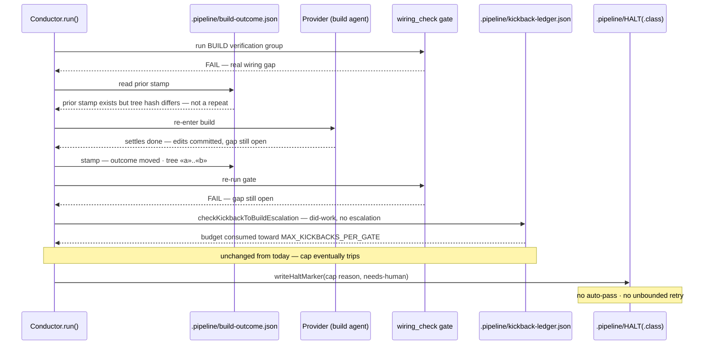

# Sequences: disputed wiring_check kickback — observed vs target

Issue: jstoup111/ai-conductor#1336
Scope: the `build` → `wiring_check` → kickback → `build` cycle, across two daemon dispatches.

## Observed failure (as-built)

## Target flow

## Negative path — a real wiring gap the build failed to close

## Legend

- `«slug»`, `«t»`, `«a»`, `«b»`, `«n»` — variable parts (feature slug, tree hashes, task id).
- Shaded block — the single new observation point this change introduces.
- `build-dispute.json` is optional enrichment: read when the agent happened to author it, never
  required for any outcome above.
- `«r»` is the escalation rung (model + effort) the dispatch would run at — part of the refusal key
  so the guard can never decline a strictly more-capable retry.

## Change Log

| Date | Change | Reason |
|------|--------|--------|
| 2026-08-05 | Initial generation | DECIDE for jstoup111/ai-conductor#1336 |
| 2026-08-05 | Applied review conditions C1–C5 | architecture-review-2026-08-05: definite-match refusal with inverted null polarity, escalation rung in the key, stamp on every terminal outcome, 200-line tail bound reusing `step_completed`, advisory-only category |
