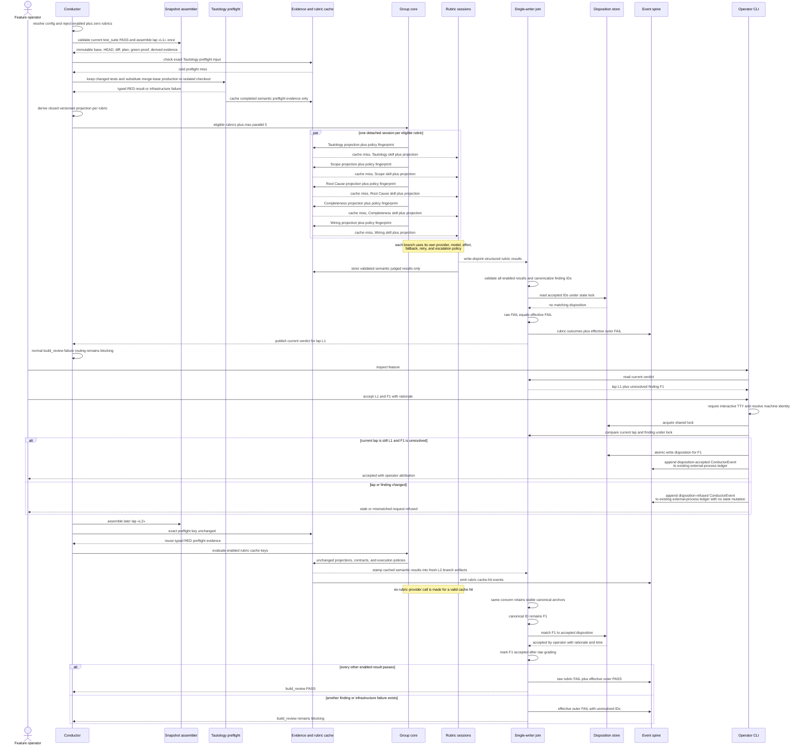

# Sequence: independent build_review grading and exact-lap disposition

**Last updated:** 2026-08-13
**Scope:** One failed `build_review` lap, one concurrent operator acceptance, and a later lap where
only the same accepted concern is non-blocking. Issue #1542.

## Diagram

## Invariants

> **Amended 2026-08-13 by #1542 architecture review:** operator events reuse the existing
> `.pipeline/pipeline-events.jsonl` same-schema external-process ledger. No operator-specific event
> file is introduced.

- The outer gate cannot pass before all enabled branches settle and the deterministic join validates
  their results. A missing, malformed, permission-denied, or provider-exhausted branch is an
  infrastructure failure, never a skip or pass.
- A disabled rubric never dispatches and emits `skipped: disabled`. Wiring also emits
  `skipped: missing-entry-points` without dispatch when its production-entry premise is absent.
  Both are excluded from pass/fail denominators and included in coverage reporting; neither is a
  pass.
- The operator acts on an inspected lap ID. Join publication and disposition mutation share one
  lock, so the CLI either accepts the exact current finding or refuses without mutation.
- Acceptance is applied after raw grading. It suppresses only the matching concern's blocking
  effect; it does not suppress execution, alter the grader prompt, or hide new findings.
- `test_suite` supplies current-HEAD green proof once. Tautology's additional test evidence is the
  isolated reverted-production RED experiment; neither live checkout is mutated.
- A cache hit requires unchanged versioned permitted inputs and execution policy. It creates new
  current-lap branch evidence before join; infrastructure failures never cache and an old aggregate
  verdict never satisfies freshness.
- PR and shipped-record rendering reads the same disposition state used by the join and presents
  accepted risk as evidence, never as a grader pass.

## Change Log

| Date | Change | Reason |
|------|--------|--------|
| 2026-08-13 | Added exact-input preflight cache before rubric projection | Post-plan architecture-diagram/review pass |
| 2026-08-13 | Added Tautology RED preflight and cache-hit path | Avoid redundant green tests and repeat rubric model calls |
| 2026-08-13 | Reused the existing external-process event ledger | Architecture review reuse check |
| 2026-08-13 | Initial proposed sequence | DECIDE phase for issue #1542 |
