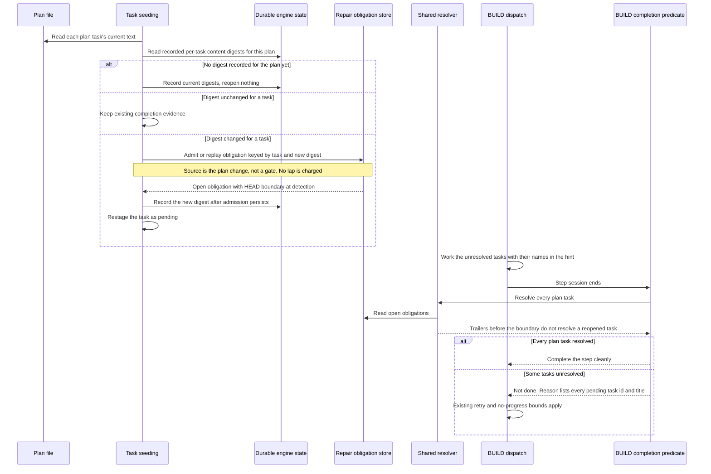

# Sequence: A plan task whose text changed is reopened before BUILD completes

**Last updated:** 2026-10-02
**Scope:** BUILD entry after the plan's task text has changed since the tasks were seeded (an operator amendment, typically followed by `rewind --to build`), and the BUILD completion reason when tasks remain unresolved. Logical sequence for architecture review; storage shape is owned by `adr-2026-09-06-reopened-task-resolution`.

## Diagram

## Legend

The digest is taken over a task's normalized plan text (heading and body), so whitespace-only edits do not reopen work. A plan with no recorded digests, such as a feature already in flight when this ships, records a baseline and reopens nothing. A reopened task can still close without a new commit through the existing engine-accepted task-close evidence (`adr-2026-09-06-reopened-task-resolution` D4), so a cosmetic wording fix does not force rework. The completion reason is the same text used by the step retry, the build stall question, and the HALT.

## Change Log

| Date | Change | Reason |
| --- | --- | --- |
| 2026-10-02 | Initial sequence | #2014: stale `Task:` trailers resolved rewritten plan tasks and let BUILD complete with every task pending |
