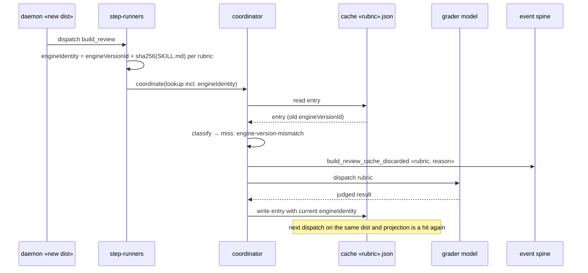

# Sequence: cached verdict discarded after an engine change (#1759)

**Last updated:** 2026-08-21
**Scope:** A warm feature's first build_review dispatch after the daemon restarts onto a new engine dist. Planned state (approach C).

## Diagram

## Legend

- Same flow applies when only the rubric's SKILL.md changed (installed skills symlink to the live checkout); the miss reason is then `skill-digest-mismatch`.

## Change Log

| Date | Change | Reason |
|------|--------|--------|
| 2026-08-21 | Initial generation | DECIDE for #1759, engineer loop |
| 2026-08-21 | Plan update: unreadable SKILL.md settles as existing `cache-read-failed` (no new reason); identity resolved in step-runners and injected | /plan for #1759 |
