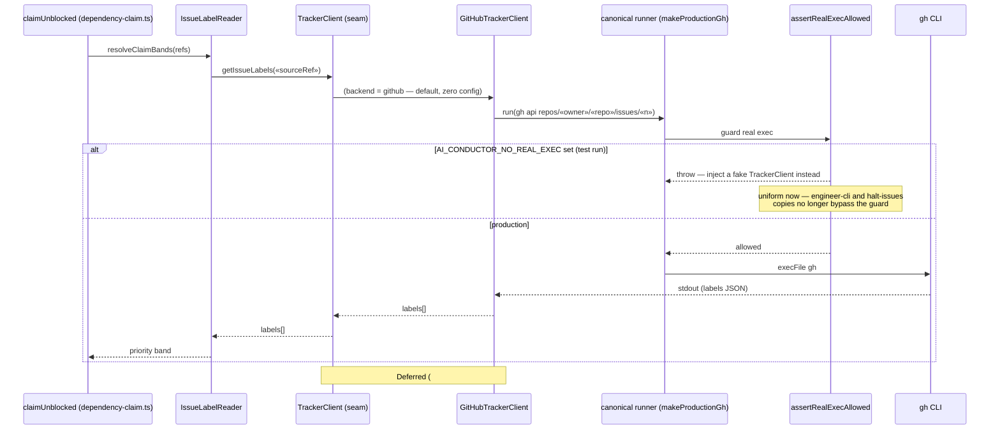

# Sequence: Issue-side operation through the TrackerClient seam (#846)

**Last updated:** 2026-07-22
**Scope:** A representative issue-side read (claim-time label read for priority
banding) flowing through the canonical seam in the target state — production path,
test/kill-switch path, and where the deferred Jira transport (#849) would diverge.

## Diagram

## Legend

- `TrackerClient` is the only seam issue-side callers see; fakes in tests implement it
  directly, so the kill-switch throw is a belt-and-suspenders backstop, not the primary
  test isolation.
- The `alt` branch shows the now-uniform `AI_CONDUCTOR_NO_REAL_EXEC` behavior — every
  real exec on the issue side passes through the single guarded factory.
- Guillemets (`«»`) mark variable parts of labels.

## Change Log

| Date | Change | Reason |
|------|--------|--------|
| 2026-07-22 | Initial generation | DECIDE architecture step for #846 (engineer spec authoring) |
