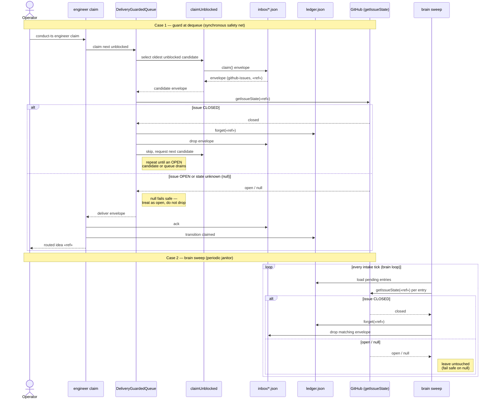

# Sequence: claim-time closed-issue guard + brain sweep

**Last updated:** 2026-07-22
**Scope:** How a closed GitHub issue is prevented from being handed to an operator at
`engineer claim`, and how the brain sweep cleans stale closed entries between claims.

## Diagram

## Legend

- **Case 1** is the synchronous guard inside `createDeliveryGuardedQueue`: it never hands a
  closed issue to the operator, and continues to the next unblocked candidate instead of
  failing the whole claim.
- **Case 2** is the new periodic sweep in the brain intake-loop tick: it keeps the ledger +
  inbox from accumulating entries for issues closed since capture, even when no claim runs.
- **Fail-safe rule:** an unknown state (`null`, e.g. a transient `gh` failure) is treated as
  still-open — never drop an issue we cannot confirm is closed.

## Change Log

| Date | Change | Reason |
|------|--------|--------|
| 2026-07-22 | Initial generation | New claim guard + brain sweep flows (spec DECIDE, tier M) |
