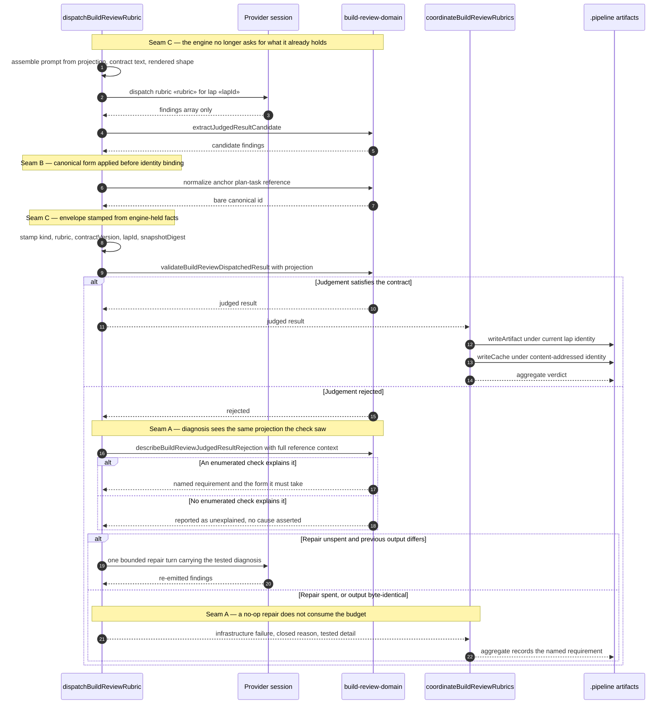

# Sequence: One rubric's judged-result round trip

**Last updated:** 2026-08-19
**Scope:** A single build_review rubric from prompt assembly to settlement, contrasting the
observed 2026-08-19 `completeness` failure with the four-seam behavior.

## Diagram

## Legend

**Observed failure this replaces.** On 2026-08-19 the `completeness` rubric emitted a fully
conformant v3 envelope whose `anchor.planTask` was `Task 7: The resolved channel and its source
are confirmed in the output`. That value is non-empty, so the diagnosis's presence check passed
and control reached a catch-all that asserted a `verdict`/`passed` contradiction the payload did
not contain. The repair turn therefore carried an instruction that could not change anything,
the re-emitted output was byte-identical three times over, and the retry budget drained into a
`needs-human` halt.

Under this sequence: seam B normalizes the reference so it binds; if it still failed, seam A
names `anchor.planTask` and the canonical form it requires; and seam A's byte-identical guard
stops the budget draining on a repair that cannot converge.

**Participants.** `SR` is `step-runners.ts`; `DOM` is `build-review-domain.ts`; `CO` is
`build-review-coordinator.ts`; `FS` is the per-lap branch artifact directory, the rubric cache,
and the aggregate.

## Change Log

| Date | Change | Reason |
|------|--------|--------|
| 2026-08-19 | Initial generation | DECIDE for `clean-rubric-judgements-rejected-as-invalid-provid` (#1683) |
