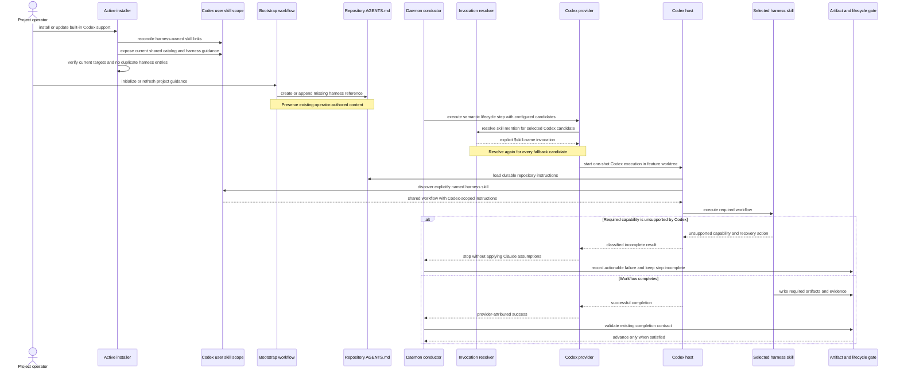

# Sequence: Codex Skill Setup and Daemon Dispatch (#904)

**Last updated:** 2026-07-25
**Scope:** Planned first-class Codex setup followed by one daemon-managed lifecycle step. The
sequence begins after provider selection and ends at the existing artifact gate; authentication,
sandboxing, usage reporting, and native interactive session recovery are outside this flow.

## Diagram

## Invariants

- Installation and update use Codex's documented user skill discovery scope and reconcile only
  harness-owned prior links.
- Repository guidance is durable and automatically loaded by Codex; bootstrap never overwrites
  unrelated operator content.
- The candidate loop resolves a provider-native explicit skill mention immediately before each
  candidate invocation. A Codex-to-Claude fallback is resolved again rather than reusing Codex
  syntax. The skill's workflow semantics and completion contract remain provider-neutral.
- Codex executes in the feature worktree through the existing provider runtime and session scope.
- Provider incompatibility is explicit and fail-closed; the lifecycle gate remains unsatisfied.
- A successful provider process is insufficient by itself: existing artifact gates still decide
  whether the step advances.

## Legend

- `$skill-name` denotes Codex's documented explicit local-skill invocation form.
- “Reconcile” means update or remove only paths proven to be owned by this harness; user-owned
  content is preserved.
- The sequence intentionally omits #905 auth/sandbox behavior and #906 usage accounting.
- Direct interactive skill use can share the installed skill and guidance contracts, but a native
  interactive Codex launcher and generalized persistent recovery remain deferred under #759.

## Change Log

| Date | Change | Reason |
|------|--------|--------|
| 2026-07-25 | Resolved the skill prompt per provider candidate | Prevent Codex syntax from leaking into a Claude fallback attempt |
| 2026-07-25 | Initial planned sequence | DECIDE architecture input for daemon-first Codex parity (#904) |
