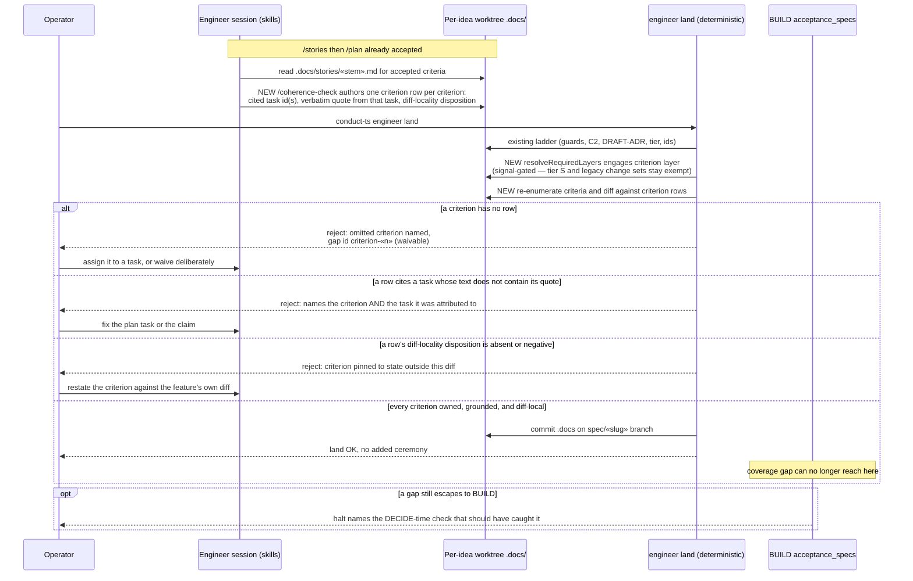

# Sequence: A criterion coverage claim from authoring to land verdict

**Last updated:** 2026-08-23
**Scope:** How the three defects in jstoup111/ai-conductor#1799 are each caught at DECIDE —
an unsupported coverage claim, an unowned accepted criterion, and a criterion pinned to state
outside the feature's own diff — instead of surfacing as a needs-human halt at `acceptance_specs`.

## Diagram

## Legend

- `«…»` — variable placeholder (plan stem, criterion index, slug).
- "NEW" marks steps introduced by this feature.
- The three `alt` branches are the issue's three named defects, in the order the issue states them.
- The quote-grounding branch is how a judgement claim is made falsifiable without running a model
  at land: the author judges *which* task carries the criterion, the engine mechanically verifies
  the quote it relied on is really in that task's text.
- The skill enumerates criteria by reading the stories file — no dedicated CLI primitive. Authoring
  completeness is not trusted: the land rung re-enumerates with the engine extractor, so a missed
  criterion is rejected by name rather than passing silently.
- The final `opt` covers the issue's last desired outcome — a late-discovered gap must name its
  upstream check rather than reporting a bare coverage failure.

## Change Log

| Date | Change | Reason |
|------|--------|--------|
| 2026-08-23 | Initial generation | DECIDE-phase design for intake #1799 |
| 2026-08-23 | Verified against the 24-task plan; no structural change | Plan-update pass (/plan step 8b) |
