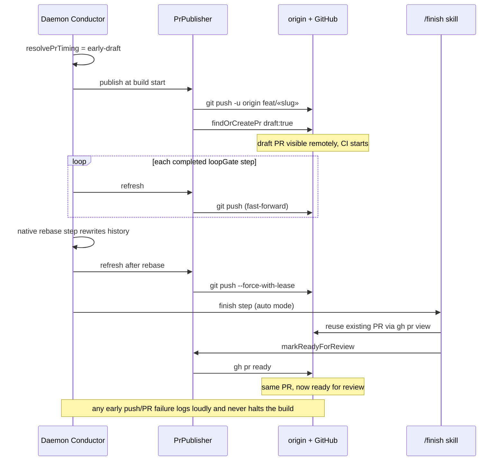
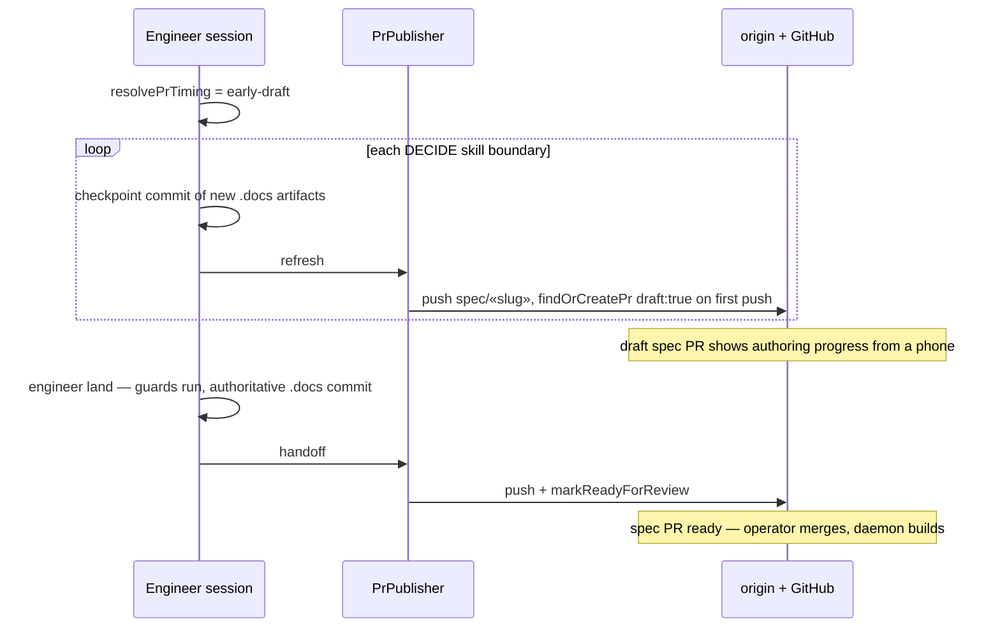

# Sequence: early-draft push/PR timing (both flows)

**Last updated:** 2026-07-03
**Scope:** Timeline of `pr_timing: early-draft` for a daemon build and an engineer spec
authoring run. `finish` mode is not diagrammed — it is exactly today's behavior.

## Daemon build, early-draft

## Engineer spec flow, early-draft

## Change Log

| Date | Change | Reason |
|------|--------|--------|
| 2026-07-03 | Initial generation | DECIDE for configurable-pr-timing (ai-conductor#199) |
