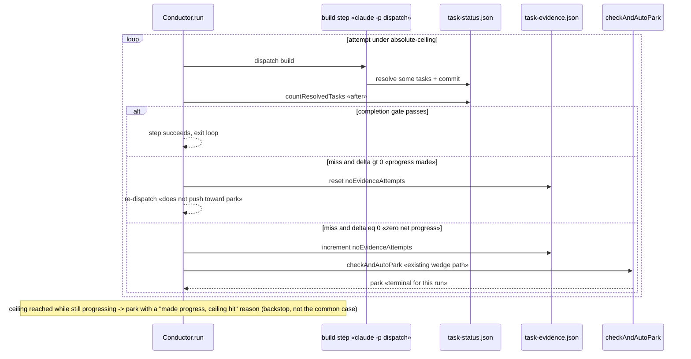
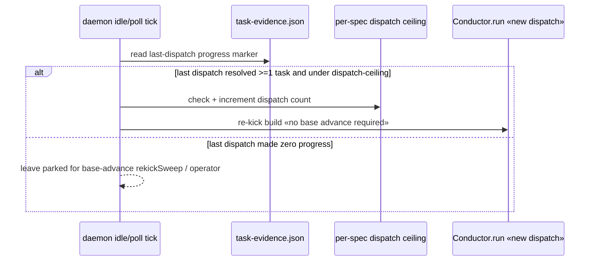

# Sequence: Progress-aware build halt/re-kick (#280)

## Within-dispatch: retry loop with progress-delta gate + ceiling backstop

## Across-dispatch: progress-gated re-kick on a quiet main

## Notes
- The zero-progress branch is unchanged from today's behavior — genuine wedges still park.
- The absolute ceiling and per-spec dispatch ceiling are the only NEW terminal conditions; both
  are configurable with conservative defaults and both emit a distinct, self-explaining reason.
- `rekickSweep` (base-advance) is untouched; the progress-gated re-kick is additive and bounded.
