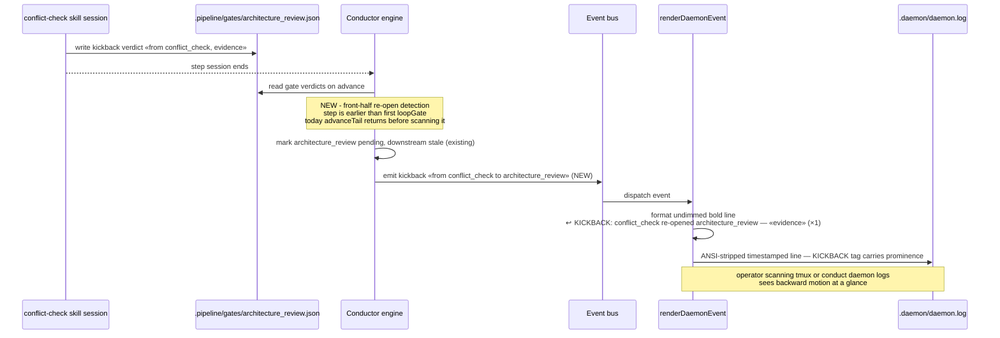

# Sequence: DECIDE-phase amendment kickback becomes a visible log line

**Last updated:** 2026-07-04
**Scope:** The currently-silent path — a DECIDE-phase skill (conflict-check or stories) re-opens architecture-review in amendment mode — from verdict write to prominent daemon log line. The tail-loop/SHIP kickback paths already emit; they reuse the same renderer case and gain only the restyle.

## Diagram

## Legend

- **NEW** annotations are this feature; state transitions (pending / stale) already happen today — only the event emission and rendering are added.
- The same `kickback` event shape is reused so the renderer has exactly one backward-motion case for engine-initiated kickbacks; `navigation_back` (operator-initiated) renders separately.

## Change Log

| Date | Change | Reason |
|------|--------|--------|
| 2026-07-04 | Initial generation | DECIDE phase for issue jstoup111/ai-conductor#240 |
