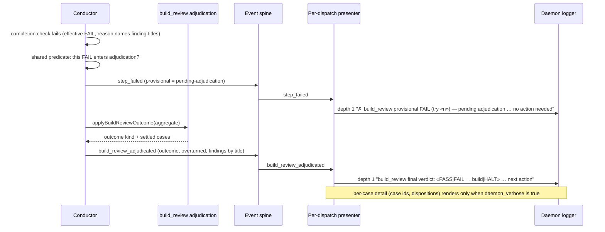

# Sequence: build_review provisional FAIL to final verdict line (#2867)

**Last updated:** 2026-10-09
**Scope:** The log lines an operator sees when build_review's effective verdict is FAIL and adjudication then decides the route.

## Diagram

## Legend

- `«n»` is the step try number. The provisional line appears only when the shared predicate says the conductor will adjudicate this FAIL; a FAIL on the legacy raw lane keeps the ordinary failed line and gets no final-verdict line.
- Exactly one final-verdict line is rendered per adjudicated lap, whatever the outcome kind (pass, repair to BUILD, decision stop, halt, mechanical retry).

## Change Log

| Date | Change | Reason |
|------|--------|--------|
| 2026-10-09 | Initial generation | Daemon log readability (#2867) |
