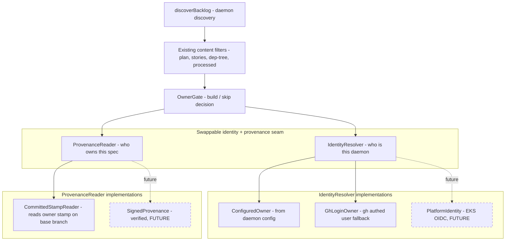
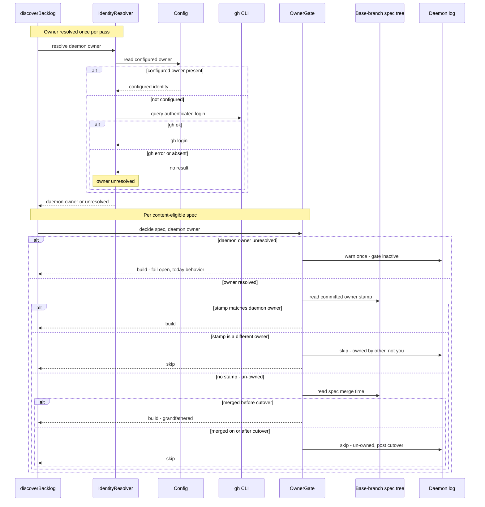

# Sequence + Components: Daemon Owner-Gating

**Last updated:** 2026-06-30
**Scope:** Where the owner gate sits inside the daemon's autonomous discovery path
(`discoverBacklog`), how the daemon owner is resolved, and the swappable identity/provenance seam
that keeps the design forward-compatible with a platform-provided (EKS) identity.

## Component View (the seam)

The dashed nodes are **not built this iteration**. The point of the seam is that `OwnerGate`
depends only on the `IdentityResolver` and `ProvenanceReader` abstractions — so a stronger,
platform-provided identity (EKS OIDC) and a verified provenance source can replace the cooperative
config/gh + committed-text implementations **without changing the gate's build/skip behavior**.

## Sequence: gating one content-eligible spec

## Legend

- **discoverBacklog** — the existing daemon discovery entry point; the owner gate runs **after**
  the existing content filters, never replacing them.
- **OwnerGate** — the new decision unit. Pure function of `spec`, resolved `daemonOwner`, the
  committed stamp, and (for un-owned specs) merge time vs. cutover.
- **Seam** — `IdentityResolver` + `ProvenanceReader` are the abstractions architecture-review must
  ratify; today's implementations are config/gh and committed-stamp, future ones are EKS-platform
  identity and signed provenance.
- **fail open** — an unresolved owner reproduces today's behavior (build all) plus a warn-once line,
  by deliberate choice (PRD FR-3 / Open Question).

## Change Log

| Date | Change | Reason |
|------|--------|--------|
| 2026-06-30 | Initial feature diagram | Created during DECIDE for daemon owner-gating |
