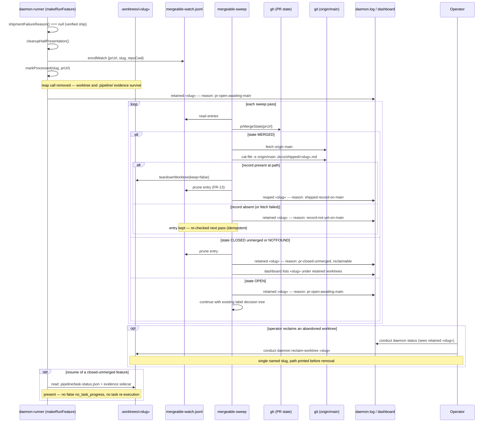

# Sequence: Ship → Retain → Reap-on-Main (#1091)

**Last updated:** 2026-07-29
**Scope:** One feature from the daemon's ship happy path through the sweep passes that decide
whether its worktree is retained or reaped, including the merged, still-open, and closed-unmerged
outcomes.

## Diagram

## Legend

- The runner's evidence check (`shipmentFailureReason` → `evaluateShipmentEvidence`) stays
  PR-head-scoped and unchanged; the new gate is a separate, main-scoped check owned by the sweep.
- The gate is **file presence at path** on `origin/main`, not ancestry — squash-merge makes the
  feature branch a non-ancestor of main even after merging (#1114, verified against PR #1138).
- Retention is not permanent for closed-unmerged PRs: the registry entry is pruned (nothing left to
  label) but the worktree is surfaced to the operator with a named reclaim verb, satisfying the
  issue's "no worktree retained forever with no way to see or reclaim it" negative path.
- Every branch of the decision emits a log line naming the driving condition, so an operator can
  distinguish a deliberate retention from a leak.
- Post-ship **CI-fix** continues to cut `.worktrees/resolve-«slug»` from the branch tip and is
  unaffected by the retained feature worktree.
- **Rebase resolution is NOT unaffected.** `isEligibleForResolve` Gate 6 (`autoresolve.ts:216-226`)
  skips any slug whose `.worktrees/«slug»` exists, so retention suppresses automatic rebase
  resolution on every open PR. Descoped from this spec to #1150 by operator decision (2026-07-29);
  tracked as the open condition on this feature's architecture review.

## Change Log

| Date | Change | Reason |
|------|--------|--------|
| 2026-07-29 | Initial generation | DECIDE for #1091 |
