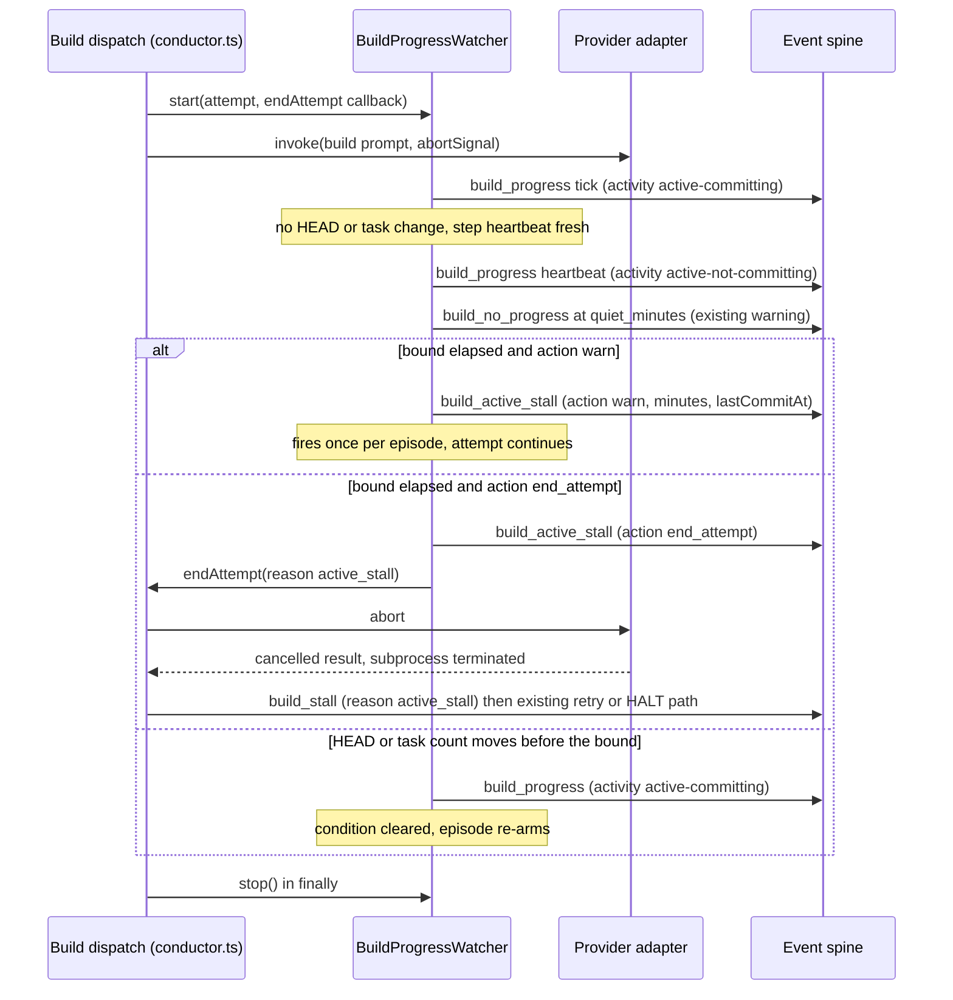

# Sequence: an active-but-not-committing build attempt

**Last updated:** 2026-10-02
**Scope:** One build attempt. The provider stays active, nothing commits, and the
`active_stall_minutes` bound elapses. Two branches follow: the default `warn` action and the
opt-in `end_attempt` action. A recovery branch shows renewed movement clearing the condition.

## Diagram

## Legend

- `build_active_stall` is the one new event type. Every other arrow uses an existing event
  with at most one added field.
- The retry/HALT path after `build_stall` is the existing attempt-end machinery; this feature
  only supplies a new reason.

## Change Log

| Date | Change | Reason |
|------|--------|--------|
| 2026-10-02 | Initial generation | #2102 |
