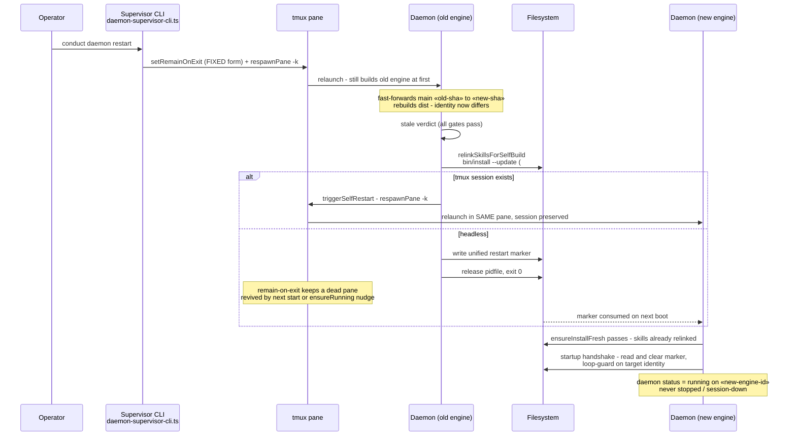

# Sequence: Origin-ahead restart converges without operator intervention (#353)

**Last updated:** 2026-07-06
**Scope:** The end-to-end flow that previously stranded the daemon `stopped`: CLI `daemon restart` while `origin/main` is ahead → fast-forward + engine rebuild → stale-engine verdict → skill relink → in-pane respawn on the new engine. Issue jstoup111/ai-conductor#353.

## Diagram

## Legend

- `«old-sha»` / `«new-sha»` / `«new-engine-id»` are placeholders for git SHAs and the versioned engine identity.
- **FIXED form** = `set-option -w -t =«name»: remain-on-exit on` — the prior invocation failed `no such window` and was swallowed, which is why the observed reproductions ended `session:down` even though the CLI restart path nominally set the option.
- The `alt` fork replaces the old unconditional write-marker-and-exit: with a live tmux session the daemon respawns itself in place via the existing tested transport; the marker+exit path survives only as the headless fallback, now recoverable because the pane remains.
- The skill relink happens **before** the respawn/exit so the successor process passes the non-interactive `ensureInstallFresh` gate.

## Change Log

| Date | Change | Reason |
|------|--------|--------|
| 2026-07-06 | Initial generation | DECIDE phase for issue jstoup111/ai-conductor#353 |
