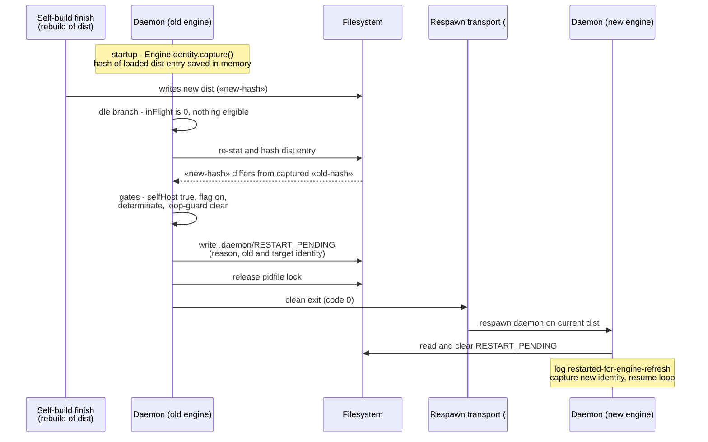

# Sequence: Daemon stale-engine auto-restart

**Last updated:** 2026-07-03
**Scope:** The exit-to-respawn flow — from a self-build merge rebuilding `dist/` to the daemon converging on the new engine. Issue jstoup111/ai-conductor#256.

## Diagram

## Legend

- `«old-hash»` / `«new-hash»` are placeholder engine-identity values.
- The transport between exit and respawn is deliberately opaque here — it is #215's restart primitive. Until #215 lands, a manual `daemon start` / `ensureRunning` nudge plays that role.
- **Superseded 2026-07-06 (#353):** this flow's exit step stranded the daemon `stopped` (transport keyed to a different marker file; `remain-on-exit` never armed). The current flow is `sequences/daemon-restart-leaves-the-daemon-stopped-when-orig.md` — respawn-in-place when a session exists, marker+exit only headless.

## Change Log

| Date | Change | Reason |
|------|--------|--------|
| 2026-07-03 | Initial generation | DECIDE phase for issue jstoup111/ai-conductor#256 |
| 2026-07-06 | Legend note: flow superseded by respawn-in-place wiring | Issue #353 (respawn gap) |
