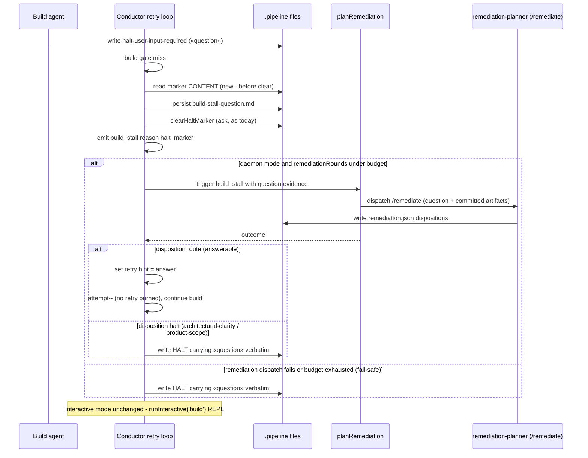

# Sequence: Daemon halt_marker stall → /remediate → resume or HALT

**Last updated:** 2026-07-10
**Scope:** Daemon-mode flow for #459 — from the build agent writing
`.pipeline/halt-user-input-required` to either an answered resume (no retry burned) or a
question-carrying HALT.

## Diagram

## Legend

- «question» = the one-line blocker text the build agent wrote into the marker.
- The `attempt--` resume mirrors the sessionExpired no-burn idiom (conductor.ts:1497).
- Budget = existing `remediationRounds < MAX_KICKBACKS_PER_GATE`; no new counter.

## Change Log

| Date | Change | Reason |
|------|--------|--------|
| 2026-07-10 | Initial generation | DECIDE for #459 (engineer spec) |
