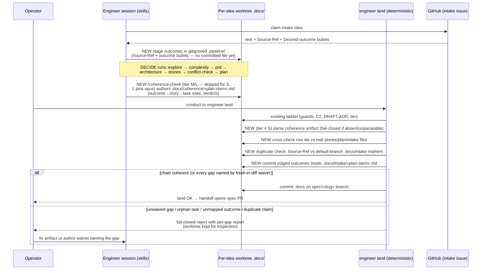

# Sequence: Coherence check from intake claim to land verdict

**Last updated:** 2026-07-22
**Scope:** The end-to-end flow for intake jstoup111/ai-conductor#539 — early outcome
persistence, mapping authoring, and the deterministic land-time validation with waiver
and duplicate-claim handling.

## Diagram

## Legend

- `«…»` — variable placeholder (slug, plan stem).
- "NEW" marks steps introduced by this feature; all NEW land-side steps are pure code
  (no model dependency at the landing boundary).
- Technical-track and no-intake specs run the same sequence with the FR layer or the
  outcome layer omitted from the mapping (never treated as a gap — PRD FR-10/FR-11).
- A trivially coherent spec takes the happy branch with zero added operator
  interaction (PRD FR-12).

## Change Log

| Date | Change | Reason |
|------|--------|--------|
| 2026-07-22 | Initial generation | DECIDE-phase design for intake #539 |
