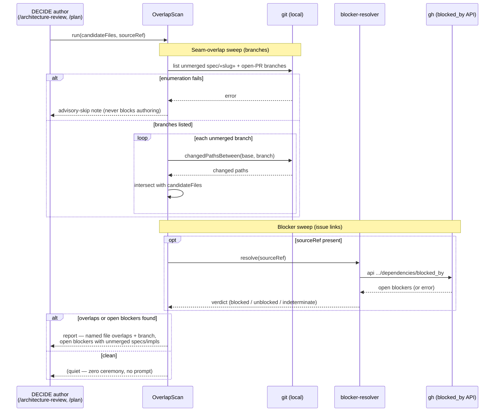

# Sequence: DECIDE-time overlap scan (#523, Scope A)

**Last updated:** 2026-07-21
**Scope:** The read-only scan flow that surfaces unmerged seam-overlap and open blockers to a
spec author before the plan locks. Covers happy path, the quiet negative path, and graceful
degradation.

## Diagram

## Legend

- **Quiet negative path** — when there are no overlapping branches and no open blockers, the
  scan emits nothing the author must act on (intake desired outcome: "zero added ceremony or
  prompts").
- **Graceful degradation** — a branch-enumeration or resolver failure degrades to an advisory
  note; the scan never blocks authoring (it is advisory, not a gate). An `indeterminate`
  resolver verdict is surfaced as such, not silently dropped.
- The base ref is resolved the same way `rebase.ts#resolveBase` does (`origin/«default»`,
  degrading to local base) — never hardcoded `main`.

## Change Log

| Date | Change | Reason |
|------|--------|--------|
| 2026-07-21 | Initial generation | Created during DECIDE for #523 Scope A |
